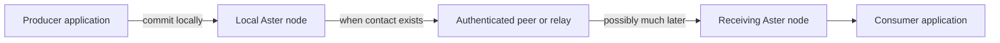

# Aster

**Keep data moving when the network disappears.**

Aster is an offline-first data mesh for applications that cannot depend on a
continuous path to a service. Applications commit data to a local node. Aster
protects it at the source, stores it durably, and exchanges it when an
authenticated contact becomes available.

Direct connections, relays, and central infrastructure can help delivery, but
none is required for the data model to remain correct. Aster is designed for
field teams, vehicles, sensors, and edge systems that move between connected,
constrained, and disconnected operation.

> [!IMPORTANT]
> Aster is an evaluation-stage reference implementation, not a
> production-authorized system. Event, State, Record, and Blob have live Rust
> APIs; Event also has a local ConnectRPC API. Review the
> [current implementation boundary](#current-implementation-boundary),
> [security gates](docs/security.md), [conformance status](docs/conformance.md),
> and [requirements status](docs/implementation/requirements-status.md) before
> planning a deployment.

## See it work

Start with **Aster Field Notes**. It opens with no processes running, asks you
to choose short-lived nearby discovery or an explicit invitation route, and
lets you add Atlas, Beacon, and Cove, write durable notes, sleep nodes, and wake
them into the same retained mesh:

    mise install
    mise run hello

The display marks an edge only after authenticated contact and marks a note at
a node only after an exact application query finds that Event. Friendly names
stay local to the display and are never discovery metadata. The
[Field Notes quickstart](docs/quickstart/hello.md) explains the ten-second
nearby windows, no-silent-fallback rule, invitation option, and exact
evaluation boundary.

To try automatic discovery across three Ubuntu hosts on one trusted LAN, build
the feature-gated agents and follow the
[three-host LAN Event quickstart](docs/quickstart/lan-mvp.md). It uses no
operator-supplied peer identities or addresses, carries one offline Event from
A through B to C across separate contacts, verifies restart persistence, and
rejects a separately provisioned outsider. This is an evaluation procedure,
not retained physical or production evidence.

For the fastest rehearsal on a native Linux Docker Engine, run the same staged
acceptance shape on one private Compose bridge:

```sh
mise run lan-mvp-compose
```

The controller validates exact delivery, outsider rejection, and peerless
restart persistence, then removes its project-scoped containers, bridge, and
volumes plus its uniquely named image. This is same-host development feedback,
not physical-LAN evidence.

After the four-node path passes, measure the current flat discovery ceiling one
tier at a time with the generated
[concurrent LAN scale baseline](docs/quickstart/lan-scale.md):

```sh
mise run lan-scale-compose -- --nodes 8
mise run lan-scale-compose -- --nodes 16
mise run lan-scale-compose -- --nodes 32
```

Each authorized node publishes offline, every authorized node must converge on
the exact complete Event set, and one different-authority outsider must remain
empty. The diagnostic reports container and contact-graph measurements but moves
no retained evidence status. Thirty-two is the intentional flat-LAN boundary
before composing scopes through filtered hierarchical bridges.

To try that bounded hierarchy, run the five-node, three-segment
[hierarchy MVP](docker/hierarchy-mvp/README.md):

```sh
mise run hierarchy-mvp-compose
```

The publisher and consumer share no IP segment. Two multi-homed, route-only
bridges discover adjacent peers without configured peer IDs or peer addresses and
carry one allowed Event from `alpha` through `parent` to `bravo`; the controller
also checks topic/priority denial, outsider rejection, payload-blind bridge
logs, and peerless consumer restart recovery. This is a same-host Docker
evaluation, not retained scale or physical-network evidence.

Then advance one explicit tier with the generated
[hierarchy scale diagnostic](docs/quickstart/hierarchy-scale.md):

```sh
mise run hierarchy-scale-compose -- --publishers-per-leaf 1
```

It composes eight leaf scopes through two regional scopes into one root while
keeping every discovery domain small. Its resource and duplicate-offer reports
are same-host development measurements, not retained capacity evidence.

For deterministic acceptance receipts, use the capability tours.

The capability tour starts real processes with independent stores and
identities, publishes while disconnected, reconnects the nodes over direct
Iroh contacts, and verifies that a second pass has nothing left to transfer.

```sh
mise install
mise run tour
```

Two focused tours expose the less familiar boundaries:

```sh
mise run tour-relay    # a relay carries protected data it cannot read
mise run tour-control  # revocation, rekey, and captured-node exclusion
```

The tours update a terminal dashboard while real processes run, then retain
their working directories and exact raw receipts for inspection. The
[capability tour](docs/quickstart/capability-tour.md) explains each result and
its limits.

For an exploratory view, keep a user-selected 2-through-32-node line running,
send messages through any node, and isolate or restart nodes while watching
exact Event observations move:

```sh
mise run playground -- --nodes 5
```

The [message playground](docs/quickstart/message-playground.md) uses real local
agent processes and independent stores. Every playground node can read the
synthetic messages; this one-host Event demo is separate from the payload-blind
relay tour and does not establish global convergence, scale, transport, or
release claims.

## How Aster moves data



- **Offline publication.** Success means the item is durable locally, not that
  a server happened to be reachable.
- **Store-and-forward delivery.** Protected data can cross several intermittent
  contacts, including relays without content access.
- **Source authentication.** Identity and protected semantic metadata survive
  every hop; carrier identity alone never grants data access.
- **Deterministic convergence.** Nodes reconcile without trusting wall clocks
  or assuming one always-online coordinator.

Read [Core concepts](docs/concepts.md) for the ten-minute mental model.

## Choose a data class

The data class defines how an item converges. It is more than a storage label.

| Class | Best for | Convergence behavior |
|---|---|---|
| **State** | Current position, device status, latest setting | Selects one current value per logical key while retaining meaningful concurrent history |
| **Event** | Messages, observations, audit entries | Preserves immutable publisher order and makes sequence gaps detectable |
| **Record** | Plans, forms, annotations, mutable documents | Preserves concurrent versions for explicit, guarded application resolution |
| **Blob** | Imagery, maps, attachments, large binary objects | Identifies immutable chunked content and supports authenticated streaming |

The [data-class guide](docs/concepts.md#choosing-a-data-class) includes a
decision tree and worked examples.

## Integrate an application

For new integrations, start with the local ConnectRPC agent. It exposes the
live Event authority over Connect, gRPC, and gRPC-Web using a checked-in
Protobuf schema and does not require a hosted Buf Schema Registry.

| Integration | Start here | Current boundary |
|---|---|---|
| **Connect, gRPC, or gRPC-Web** | [ConnectRPC agent](docs/quickstart/connect-agent.md) | Live Event and local status; authenticated loopback process |
| **Rust selected node** | [Selected Event API](docs/quickstart/selected-event-api.md) | Live Event publish, query, durable delivery, gaps, and status |
| **State or Record in Rust** | [State](docs/quickstart/selected-state-api.md) and [Record](docs/quickstart/selected-record-api.md) | Cloneable live actor handles plus exclusive stopped-node facades; direct-Iroh reconciliation under explicit interests; State adds durable positive-current-version delivery and Record adds retained-bounded durable whole-key active-head delivery |
| **Blob in Rust** | [Blob](docs/quickstart/selected-blob-api.md) | Cloneable `RunningNode::selected_blobs()` handle for durable file publication, bounded pages, and metadata-only at-least-once publication delivery, plus an exclusive stopped facade; already-durable Blob data can transfer directly under semantic v5 |
| **Rust semantic API** | [Rust quickstart](docs/quickstart/rust.md) | Broader proven semantic surface used as the migration source |
| **Python, Go, or C** | [Language quickstarts](docs/quickstart/README.md) | Offline semantic API through the current C ABI, not the selected live node |

The [application recipes](docs/application-recipes.md) show all four data
classes, queries, subscriptions, batches, deletion, conflicts, and emission
policy. Kubernetes, Zarf, and UDS integrations should treat the ConnectRPC
agent as the application boundary; deployment packaging and protected
provisioning remain open work.

## Current implementation boundary

| Surface | Implemented | Still open |
|---|---|---|
| **Event** | Source-authenticated reconciliation over direct Iroh or one operator-pinned controlled Iroh connectivity relay; live Rust and local ConnectRPC APIs; durable consume/carry selectors and at-least-once delivery | Atomic subscription update, production automatic/hosted discovery, public relay selection, and broader physical-network acceptance |
| **State** | Source-authenticated live or stopped publication/query, causal projection, direct-Iroh reconciliation under explicit interests, durable positive-current-version delivery, and bounded retained one-host evidence including forced-process redelivery | Contact/status and materialized-view/synthetic-withdrawal behavior, dynamic network-interest mutation, selected-node bindings, finite TTL, relay acceptance, expiry/garbage collection, and representative physical/mixed evidence |
| **Record** | Live or stopped conflict-preserving query/publication, exact-sibling guarded resolution, direct-Iroh reconciliation, durable whole-key active-head delivery, and bounded retained one-host conflict, forced-process redelivery, resolution, and reopen evidence | Selected-node bindings, automatic merge execution, finite TTL, relay acceptance, expiry/garbage collection, and representative physical/mixed evidence |
| **Blob** | Authenticated immutable publication through a cloneable live Rust handle or exclusive stopped facade; bounded zeroize-on-drop pages; durable metadata-only application delivery with exact publication identity and token-bound acknowledgement and bounded retained one-host forced-process-redelivery evidence; direct semantic-v5 source/carrier transfer with durable resume state and bounded retained one-host interrupted/reopened/different-peer evidence | Peer/convergence and transfer-progress status, network/application selector-separation acceptance, route-only relay/custody, arbitrary-peer resume, power-loss/filesystem-crash/long-offline recovery, large/RSS acceptance, representative physical or mixed-implementation evidence, retention, garbage collection, and release authorization |
| **Static Event hierarchy** | Profile-`0x0001` authenticated directed edges, exact topic/priority narrowing, route-only first and nested wrappers, durable redb candidates with fresh restart promotion, and a semantic-v6 selected runtime. Opt-in [hierarchy MVP](docker/hierarchy-mvp/README.md) and [generated scale](docs/quickstart/hierarchy-scale.md) Compose diagnostics cross isolated IP/mDNS segments without configured peer coordinates. | Supported bridge administration, live join/leave, bandwidth and complete storage quotas, dynamic routing/interest policy and revocation/rekey lifecycle, cross-class bridge custody, physical/mixed operation, retained bridged-scale evidence, and complete-MVP credit |
| **Security profiles** | Stock runtime profile `0x0001` retains hybrid-PQ source/control, mission handshake, and Aster records. Additive profile `0x0002` exposes a provisioned P-256 semantic-v1 Event/control and exporter-bound two-node Iroh path without a second Aster application record. | Stock runtime/CLI selection, authenticated offers or general negotiation, complete classical data/lifecycle coverage, snapshot-resistant rollback, retained capture/resource evidence, independent interoperability, and release authorization |
| **Operations** | Manually admitted direct addresses, an operator-pinned controlled relay, default-off Iroh-compatible mDNS evaluation modes for exact rostered peers or mission-authorized `--discover-lan` contacts in repeated maximum-30-second windows, explicit bounded IPv4 interface selection for multi-homed discovery, bounded one-host software namespace-NAT acceptance, reference mission provisioning, and bounded same-UID Unix software zeroization | Protected operational provisioning, physically qualified/hostile-bounded production discovery, representative/physical NAT, public/default relay selection, BTLE platform integration, physical sanitization, and release authorization |

## Customer-readiness priorities

The shortest supportable path to customer use is a deliberately narrow Linux
and Event-only product profile. It should promise durable transfer across
intermittently available approved IP paths, not seamless multipath networking
or real-time streaming. Work should proceed in this order:

| Priority | Task | Minimum completion evidence |
|---|---|---|
| **P0** | Freeze and document the first supported profile | One versioned profile covering Linux, Event, bounded payloads and node counts, manually admitted direct peers, one customer-controlled pinned relay, explicit quotas, and default-off LAN discovery; unsupported State, Record, Blob, public-relay, and dynamic-routing behavior is rejected or clearly marked preview |
| **P0** | Make the release gate deterministic | The pinned `mise run check` passes from a clean checkout; network integration tests remain reliable under loaded CI; the secure file-creation umask is established by the runner; every language binding reports semantic version 6; future-incompatible dependencies are removed or dispositioned |
| **P0** | Produce reproducible deployable artifacts | Signed Linux packages and container images build from locked, reviewed inputs through an approved package proxy or vendored offline dependencies; enterprise CA installation is supported without disabling TLS verification; SBOM, provenance, license notices, checksums, upgrade, rollback, and uninstall procedures ship with each release |
| **P0** | Replace reference provisioning with an operational secret boundary | Node and mission material can be installed, rotated, revoked, backed up, restored, and destroyed through an approved protected provider; plaintext credentials are never required in arguments, logs, images, or ordinary configuration files |
| **P0** | Establish a customer-operable Event service | The loopback ConnectRPC agent has stable configuration, health/readiness endpoints, bounded publish/query/subscription behavior, documented acknowledgement and retry semantics, service-manager integration, graceful shutdown, crash recovery, and actionable sanitized errors |
| **P1** | Qualify unstable direct and relay paths | Retained tests cover packet loss, latency, reordering, bandwidth limits, NAT rebinding, address replacement, interface loss, long outages, process termination, relay loss, and recovery; they prove no unauthorized disclosure, no accepted-data loss, bounded resource use, and eventual delivery after an approved path returns |
| **P1** | Add controlled IP multi-network switching | A bounded supervisor observes interface and route changes, refreshes approved endpoint candidates, reauthenticates every new contact, prefers usable direct paths, falls back only to the pinned relay, retries direct paths after backoff, and exposes every path transition without transferring authorization between interfaces |
| **P1** | Ship production observability and capacity controls | Operators can monitor queued items and bytes, oldest pending age, last authenticated contact, direct/relay selection, retry deadlines, path transitions, storage pressure, rejected work, and saturation; alerts and sizing guidance are validated at the supported node and payload limits |
| **P1** | Harden controlled-relay operations | The relay has documented certificate rotation, peer allowlisting, quotas, denial-of-service bounds, health checks, log redaction, backup-free recovery, upgrade procedures, and an availability model appropriate to the first customer deployments |
| **P2** | Expand beyond the Event MVP only after field evidence | State, Record, Blob, dynamic hierarchy, automatic discovery, and additional carriers each receive an explicit API, lifecycle, relay, recovery, resource, physical-network, and mixed-implementation acceptance gate before entering the supported profile |

The [capability roadmap](docs/implementation/capability-roadmap.md) is the
planning and merge-review view. The
[requirements status](docs/implementation/requirements-status.md) remains the
authority for exact evidence and open acceptance gates.

## When Aster fits

Aster is a strong fit when:

- applications must keep publishing without peers or infrastructure online;
- data may cross several intermittent contacts before reaching a consumer;
- links are too constrained to resend an entire dataset;
- conflicts must remain explicit and reproducible without wall-clock ordering;
- relays should forward authorized data without reading it; or
- one application model must survive movement between carriers.

Aster is not a message broker, general-purpose database, VPN, radio manager, or
real-time media transport. If every client can reliably reach one service, a
conventional database or broker will usually be simpler.

## Find the next document

| Goal | Read |
|---|---|
| Understand the model | [Core concepts](docs/concepts.md) |
| Run a working example | [Capability tour](docs/quickstart/capability-tour.md) |
| Build an application | [ConnectRPC agent](docs/quickstart/connect-agent.md) or [language quickstarts](docs/quickstart/README.md) |
| Understand trust and component boundaries | [Selected architecture](docs/architecture.md) |
| Connect nodes or evaluate carriers | [Carriers and contacts](docs/transports.md) |
| Implement compatible protocol bytes | [Protocol](docs/protocol.md), [wire grammar](docs/wire.cddl), and [security objects](docs/envelope.md) |
| Assess progress or readiness | [Capability roadmap](docs/implementation/capability-roadmap.md), [requirements status](docs/implementation/requirements-status.md), [conformance](docs/conformance.md), and [security](docs/security.md) |
| Review development inputs and provenance | [Public development provenance record](docs/provenance/independent-development-record.md) |
| Browse all project records | [Documentation index](docs/README.md) |

## Repository map

| Area | Purpose |
|---|---|
| [`crates`](crates) | Selected node, carrier, persistence, protocol, semantic reference, and conformance implementations |
| [`bindings`](bindings) | C ABI plus Go and Python wrappers |
| [`docs`](docs) | Guides, concepts, specifications, decisions, and evidence |
| [`lab`](lab) | Controlled network and impairment experiments |
| [`fuzz`](fuzz) | Parser and protocol robustness targets |

## Build and verify

```sh
mise install
mise run check
```

See [CI and local validation](docs/ci.md) for narrower checks and the precise
claim attached to each gate.

## License

Licensed under the Apache License, Version 2.0. See `LICENSE`.
Distribution notices for approved dependency exceptions are in
[THIRD_PARTY_NOTICES.md](THIRD_PARTY_NOTICES.md).
