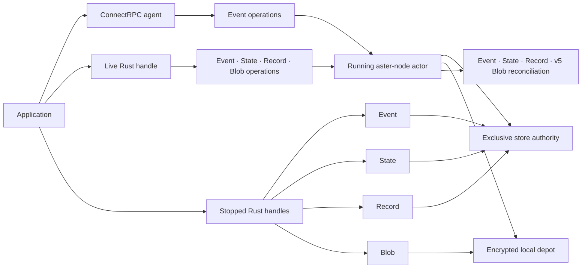
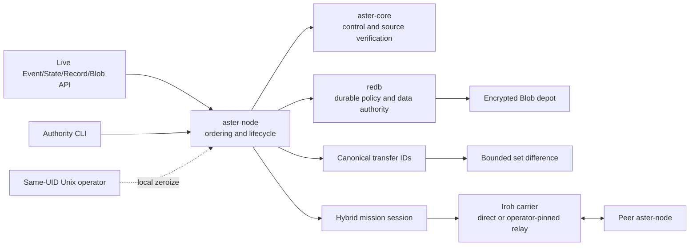
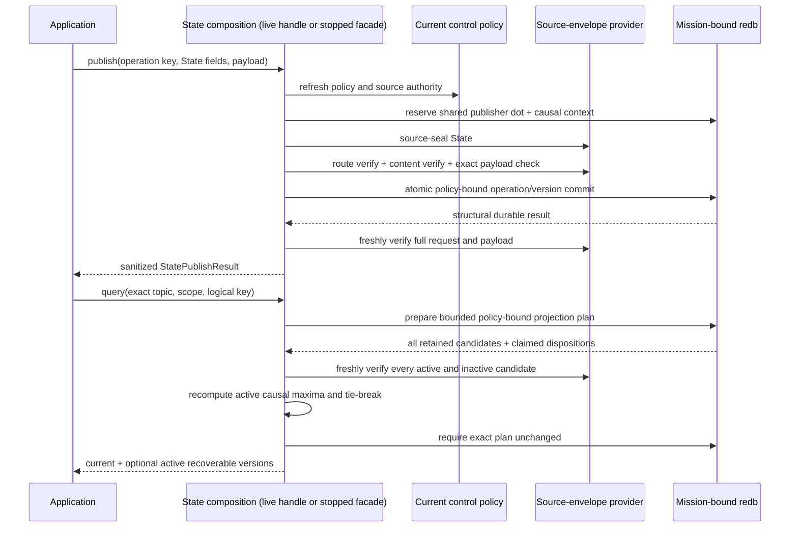
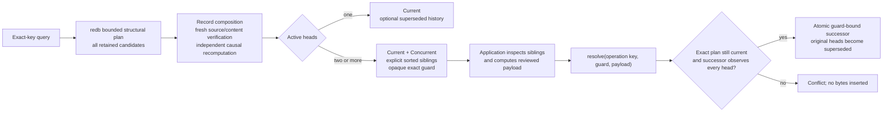
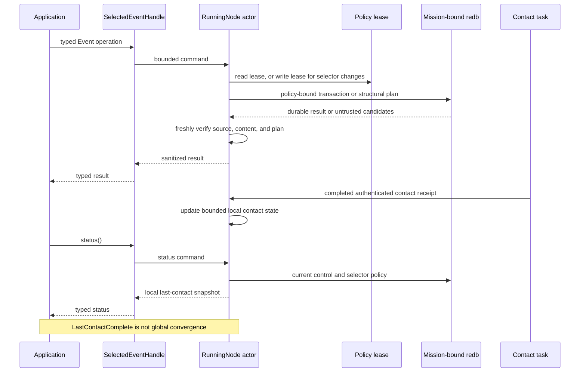
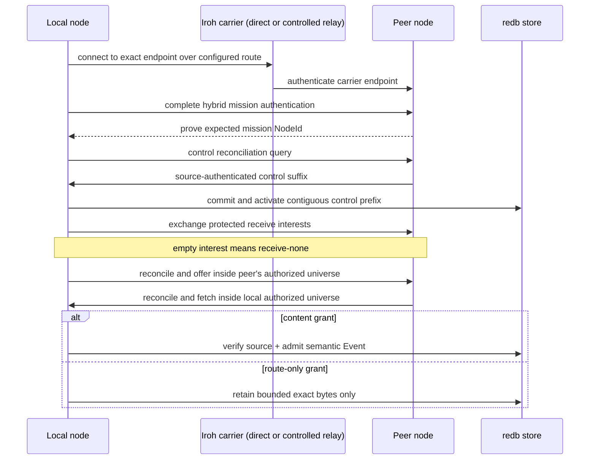
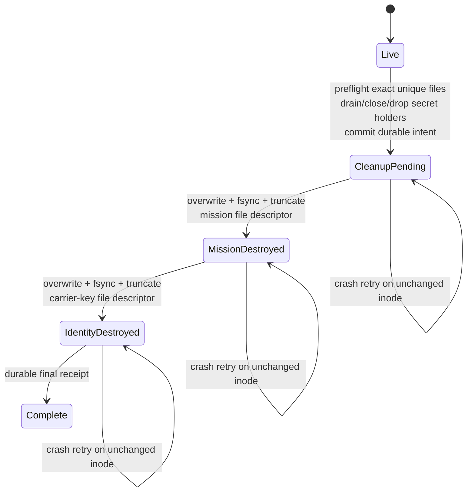

# Selected production-lane architecture

This page explains how the selected implementation turns Aster's concepts into
runtime authorities and trust boundaries. It is intentionally narrower than
the complete protocol and semantic reference implementation.

| Data class | Selected networking | Application surface |
|---|---|---|
| Event | Direct Iroh or one operator-pinned controlled Iroh relay | Live Rust handle, stopped Rust handle, and local ConnectRPC agent |
| State | Class-specific direct-Iroh reconciliation | Cloneable live Rust handle and exclusive stopped Rust facade |
| Record | Class-specific direct-Iroh reconciliation | Cloneable live Rust handle and exclusive stopped Rust facade |
| Blob | Semantic-v5 direct source/carrier transfer | Cloneable live Rust handle, exclusive stopped Rust handle, and encrypted local depot |

Read the diagrams from broadest to narrowest: application surfaces, runtime
ownership, then the publication and contact flows for each mechanism. Exact
evidence and remaining release gates live in
[requirements status](validation/requirements-status.md), not in these
diagrams.

## Components and trust boundaries

### Application surfaces



The running actor and stopped handles never own the store at the same time.
State and Record applications may publish/query—and for Record, resolve—through
the running actor, or use their stopped facades after the actor exits. Objects
published through either mode reconcile under the same authority. Blob
applications likewise publish through the live handle or stopped facade; the
live handle returns only bounded pages, while the stopped facade supports
caller-owned streaming. Semantic v5 separately transfers already-durable Blob
sources and bounded carrier prefixes directly between content-capable peers.

### Runtime trust path



`aster-node` is the sole composition root. `aster-iroh` authenticates only the
carrier endpoint and provides bounded direct exchange or exchange through one
operator-pinned controlled relay. That relay is connectivity infrastructure,
not an Aster mission node, store, or route grant. The mission `NodeId` is
independent from the Iroh `EndpointId`. `aster-negentropy` computes exact-ID set
difference; it does not transfer objects, establish causality, or make policy.
`aster-redb-store` is the selected durable authority for accepted Events,
State, Record, and local Blob publications, their shared publisher causal
frontier, ordered control effects, policy/selector snapshots, at-least-once Event delivery, route-only
Event representations, and the terminal zeroization marker. State, Record, and
Blob operation rows have separate dedicated count/byte ceilings and also
participate in aggregate store quotas; no unbounded idempotency table is
implied. Blob ciphertext is stored outside redb under separate committed-byte,
chunk, and variant ceilings, while redb remains the authority for exact
publication and committed-file markers. On its first successful open, redb
persists a domain-separated commitment over a random owner token, canonical
database path, and Unix device/inode when available. The fixed sibling depot’s
private marker must carry the same binding before any chunk/variant scan or
reclaim. The first database to initialize a parent’s depot wins; another cannot
adopt it. Moving/copying even an empty bound database to another path fails on
reopen. On Unix, a new inode also fails, moving the depot with the database does
not preserve the binding, and a same-path replacement cannot adopt an existing
depot. Non-Unix does not prove copied-database replacement/rollback resistance
at the same canonical path. No supported rebind/restore migration is provided
in this slice.

Live Event, State, Record, and Blob handle clones do not open a second store.
They send commands over one 32-command channel to the actor that already owns
the mission-bound writer. Blob commands are dispatched without blocking that
actor to one joined worker with a one-command queue; the worker rechecks current
policy and lineage rather than retaining an actor lease across file I/O or
decryption. Event commands that insert or remove selectors take the actor's
policy write lease; State/Record publish/query/resolve and other application
operations use the policy read lease. Contacts use that same actor-owned
policy/store authority. Shutdown or zeroization closes shared and Blob-worker
admission, rejects queued commands, and joins the worker before the authority
or key-bearing state is released, so retained clones return sanitized
`StateUnavailable`. A stopped facade can acquire the writer only after the live
actor has exited and must close before a new actor starts.

Each mission-authenticated contact runs class-separated State and Record
Negentropy/fetch lanes after its control and Event lanes. A receiver supplies
canonical topic/scope interests independently for each class; empty means
receive-none. Interest never grants authority. Inventory and every offered or
fetched object are filtered and freshly checked against current mission, route,
content, revocation, scope-epoch, source, class, topic, and scope constraints.
The contact holds one control-policy read lease, so inventory and admission use
one policy generation. Exact transfer identities make repeated receipt
idempotent. Remote finite-TTL mutable objects fail closed until authenticated
cumulative forwarding age exists.

## Live or stopped State publication, projection, and network reconciliation

The selected State composition uses the same mission, control policy,
source-envelope provider, writer lock, and causal ledger as Event. A State
publisher counter therefore cannot restart at one or reuse an Event dot. State
storage is additive and uses its own typed transfer identity and reconciliation
frames; it cannot be confused with either Event or Record traffic.



The durable operation mapping is structural state inside the privileged store,
not an application capability. Even an exact replay must pass current mission,
revocation, source, topic, scope, and content authorization before the original
result is returned. A previously committed old-epoch operation can resolve only
under that current authority; a future-epoch representation is rejected. The
facade then freshly verifies the returned semantic identity, protected header,
and exact plaintext against the complete publication request.

Projection is causal and clock-independent. For one exact topic/scope/logical
key, a version dominates another only when its authenticated causal context
observes the other's dot. The active causal maxima are retained; the greatest
complete semantic State ID is the deterministic current version, and any other
maxima are `Concurrent`. Dominated versions are `Superseded`. The store supplies
a structural plan, the facade independently recomputes that result from freshly
verified capabilities, and the store rechecks the exact plan before return.

Inactive revoked or old-epoch rows are still included in the bounded plan and
freshly verified so they cannot hide structural corruption, but they are not
returned as application current or recoverable values. A current tombstone is
returned visibly as authenticated State with an empty payload. There is no
delete-wins rule, and deletion is not collapsed into an unauthenticated
`None`. A
[retained 7,752-byte v2 receipt](validation/evidence/selected-live-mutable-6cabb4c.json)
(SHA-256
`054945ecf94e8bfba1b130f6a5f47e9b1e0e17ad69f3b1472085a1d10f05eeaa`,
signed source `6cabb4c`) first verifies two disconnected State heads as the exact
max-ID-current/other-concurrent projection. In the producer-attested ordered
loopback chain, a later successor observes and supersedes both heads; after the
other actor observes that successor, its authenticated empty tombstone observes
and supersedes all three predecessors. Both actors select the tombstone as
current, and one immediate peerless restart reproduces that exact four-version
projection. This is one-host, same-implementation evidence, not indefinite
tombstone retention, garbage collection, delete-wins, physical or mixed
implementations, scale, or release acceptance. Expiry, durable State
subscriptions, selected-node bindings, relay/multi-hop acceptance, finite TTL,
and independent interoperability remain unimplemented.

## Live or stopped Record projection, guarded resolution, and network reconciliation

The selected Record composition uses the same mission, control policy,
source-envelope provider, writer lock, and causal ledger as Event and State.
Its tables, markers, exact/semantic indexes, and operation ledger remain
class-disjoint, while a Record publisher cannot reuse a causal dot already used
by either other class. Record storage is additive and uses its own typed
transfer identity and reconciliation frames.

For one exact topic/scope/logical key, every active causal maximum is a head.
The greatest complete semantic Record ID is marked `Current`; every other head
is returned as `Concurrent`; causally dominated active revisions are optionally
returned as `Superseded`. That deterministic current marker is a stable
projection, not a silent merge or discard.



Ordinary `publish` fails when its causal reservation observes two or more
existing heads, so it cannot bypass the explicit resolution path. The guard
binds the complete sorted sibling set and the policy-bound projection. The
durable operation digest binds the publication intent and sorted guarded head
identities: an exact retry returns the original commit, while the same operation
key with another head set fails.
The store requires a new resolution successor to observe every guarded head and
atomically rejects a stale guard if the projection advanced.

On query and resolution the store's rows and plan are privileged structural
inputs, not capabilities. The facade freshly verifies every retained active or
inactive candidate, recomputes heads and dispositions, and rechecks the exact
plan before exposure or commit. Inactive revoked or old-epoch rows are not
returned to the application. A current Record tombstone remains visible with an
empty payload; a concurrent tombstone has no delete-wins priority.

Registered merge policies are never run automatically by this selected slice.
Remote ingest stores an immutable, already source-authenticated revision and
recomputes structural causal heads without invoking application code. A
retained direct-Iroh acceptance run publishes one revision through each live
handle while disconnected, reconciles both directions under an explicit Record
interest, verifies that both actors retain the same two heads, rejects an
ordinary conflict-collapsing publish without changing them, then resolves and
exactly retries the guard through the live authority. Both original heads are
superseded, and the resolved projection survives restart. The
[canonical v2 receipt](validation/evidence/selected-live-mutable-6cabb4c.json)
does not establish physical-network or mixed-implementation acceptance. Record
still has no durable application subscription, selected-node binding, or
selected relay acceptance. Multi-hop/partition sweeps, independent
interoperability, finite TTL, expiry, garbage collection, and retention-driven
deletion remain unimplemented.

## Live and stopped Blob streaming and depot authority

The selected Blob facade uses the same mission, current control policy,
source-envelope provider, process-exclusive writer, and shared causal ledger as
Event, State, and Record. A running node exposes a cloneable
`SelectedBlobHandle`; the exclusive `SelectedBlobNode` remains available for
stopped-state streaming after the actor exits. Live publication accepts an
owned, already-open regular file positioned at byte zero, rejects empty input,
and is capped at 64 MiB/1,024 canonical 64-KiB chunks. A live read returns one
freshly authenticated, zeroize-on-drop plaintext page of `1..=64 KiB`; the
stopped facade retains its synchronous caller-owned streaming interface. The
runtime separately adds semantic-v5 Blob source and carrier-range frames; v1-v4
emit none. `BlobId` commits the exact plaintext bytes, canonical chunk profile,
and media/schema identity metadata. It is not a metadata-independent whole-byte
content identifier.

```mermaid
sequenceDiagram
    participant A as Application
    participant N as Blob composition (live handle or stopped facade)
    participant C as Source-envelope and Blob provider
    participant S as Mission-bound redb
    participant D as Encrypted Blob depot

    A->>N: publish(operation key, metadata, bounded source)
    N->>S: current policy + exact operation preflight
    N->>C: bounded preparation pass
    N->>D: encrypt, sync, rename, then mark each chunk
    N->>C: source-seal and freshly verify canonical manifest
    N->>D: prove every authenticated record and final digest
    N->>S: atomic publication + operation commit
    N->>C: freshly verify durable publication result
    N-->>A: sanitized BlobPublishResult

    alt live read_page(≤64 KiB)
        N->>S: exact-load current selected projection
        N->>C: authenticate selected source; check inactive projections against cache capabilities
        N->>S: require current policy, lineage, and plan
        N->>D: require exact completion and decrypt bounded range
        N->>S: recheck authority, completion, and lifecycle
        N-->>A: zeroize-on-drop page
    else stopped read_into(caller output)
        N->>S: bounded structural plan with every retained source
        N->>C: freshly verify every manifest and source/content capability
        N->>N: select greatest active semantic publication ID
        N->>S: require exact policy-bound plan unchanged
        N->>D: prove selected completion once and stream verified chunks
        N-->>A: BlobReadResult
    end
```

The first publish pass uses one bounded, zeroizing plaintext chunk buffer and,
after completion, retains only a manifest-bounded digest vector and no
plaintext; the second uses bounded buffers to encrypt chunks. A chunk becomes
durable only after private temporary-file write and synchronization,
same-directory rename, directory synchronization, and an exact redb
committed-chunk marker. Unmarked
temporary or final files are not authority and are reclaimed on a writable
mission-bound reopen. A marker whose file is missing, truncated, or different
fails integrity and is never reconstructed from a filename or header claim.
A source publication is committed only after the exact authenticated manifest
equals every expected and committed depot record and the finalized manifest
digest.

The stopped read plan is structural, not authorization. That path freshly
verifies every retained active or inactive source publication, checks the exact
topic, scope, Blob ID, content group, epoch-specific depot variant, and source,
then independently recomputes the active deterministic selection. Only after an
exact plan recheck does it require one authenticated completion capability for
that exact selected depot variant and synchronously stream plaintext into
caller-owned output.

The live path exact-loads and content-authenticates only the selected current
source. Inactive candidates are projection-checked against
startup-authenticated cache capabilities; their sealed bytes are not rehashed
for every page. Current policy, lineage, lifecycle, and the exact completion
capability are checked around range decryption before a zeroize-on-drop page of
at most 64 KiB, spanning at most two canonical chunks, is disclosed. No
provider reader or copied epoch key escapes either surface. A late
stopped-stream integrity failure can leave an already verified prefix in
caller-owned output, so applications needing all-or-none replacement use their
own temporary destination.

Ordinary request, policy, conflict, and capacity failures are sanitized for the
application. A contradiction among durable Blob rows, the authenticated source
cache, the exact depot capability, or post-commit verification is actor-fatal
coherence loss: the joined worker reports `FatalBlobCoherence`, closes shared
application admission, and makes the exact failure visible through node
completion rather than continuing with a potentially split authority.

Exact operation retry rehashes the source, passes current policy and revocation
checks, and freshly verifies the historical publication and variant before
returning the original counter and marker. A different operation may commit a
new signed publication while reusing the same immutable completed variant in
one content group and epoch. Rekey creates a distinct encrypted variant even
when object identity is unchanged.

Under semantic v5, a content-capable receiver reconciles exact Blob source IDs
before requesting only missing, peer-neutral 16-KiB carrier prefixes. Every
source and range send requires the authenticated peer's current exact content
proof plus route and nonrevocation authority. Pending bytes remain outside
ordinary publication until the exact depot, full-content, and current-lineage
proofs agree atomically. This is bounded direct, same-implementation automation,
not route-only Blob relay/custody or Blob-over-controlled-relay acceptance. A
[retained 10,728-byte v2 live-Blob receipt](validation/evidence/selected-live-blob-044d90f.json)
(SHA-256
`4fea2ffbd16608862a67167fb1b8fcb6d5d8b4b82c576aa9a6b7e25ee9c55909`)
binds signed source commit `044d90ff07c8e754b3d490cb810d42de3c915e3d`
with `Good` signature status. Its three participants ran 11 actor lifetimes and
32 error-free direct `CONTACT` records: a publisher committed while peerless; a replica
received all 98,638 carrier bytes; a receiver retained an interrupted
exactly-one-contact 16,384-byte prefix, reopened peerless with that exact
progress, resumed exactly 16,384 bytes from the different replica without
refetching the source, fetched the exact remaining 65,870 bytes, reconstructed
all 98,638 carrier bytes, and reopened peerless for a final authenticated read.
Its source-to-execution link remains operator-attested, not cryptographically
proven. This is one-host, same-implementation evidence of graceful same-process
actor/store/provider reopen only. It does not prove process-crash, power-loss,
long-offline, arbitrary-peer, or route-only resume; NAT, Internet, relay, or
BTLE paths; independent-implementation interoperability; scale beyond three
participants; resource thresholds or soak; physical sanitization; or release
authorization.

`BlobDepotLimits` reserve canonical ciphertext-file bytes for every durable
expected chunk record and bound durable per-chunk metadata rows and
epoch-specific import variants. Rows and variants include retained unpublished
imports, whether expected-only or already finalized, and continue to consume
admission until a future explicit-GC policy exists. The limits do not claim to
measure redb allocation, directory blocks, snapshots, backups, swap, unrelated
attacker-created directory entries, or every filesystem overhead. Unix
depot operations use owner-controlled directory descriptors, no-follow checks,
and private modes; the non-Unix fallback is not credited with equivalent
filesystem hardening. Terminal software zeroization destroys the retained
mission/content and identity secrets and locks the store, but deliberately
preserves the encrypted Blob depot and audited data rows. This is bounded
cryptographic shredding, not Blob-file deletion or physical sanitization.
Current code has a durable metadata-only exact-publication Blob delivery
ledger; its local counts are not peer or convergence status. Retained
delivery acceptance, Blob peer/convergence status, route-only relay/custody,
Blob-over-controlled-relay
acceptance, arbitrary-peer resume, crash/power-loss/long-offline recovery,
finite TTL, retention/GC, large/physical acceptance, mixed implementations,
and representative network evidence remain open.

## Live application command and status flow



Selector changes take the policy write lease and update the selector generation
and delivery ledger atomically. Publish, query, poll, acknowledge, gaps, and
status take a read lease. Candidate rows and store plans are structural input,
not trusted application results; the actor verifies them before returning
sanitized values.

Gap results follow the same trust rule. The store prepares a bounded structural
plan, the selected node freshly verifies every observed source position, and
the store rechecks the exact policy-bound plan before a half-open gap interval
is exposed. Absence of a returned gap says only that the locally observed,
verified positions in that page are contiguous; it is not publisher
completeness or mesh convergence.

The [retained 9,573-byte live-Event receipt](validation/evidence/selected-live-event-c464129.json)
(SHA-256
`4d71d04e4ebcc9f63c0e84e7f11e83bf1f3d1ad2ca8608486cdcc875b6dfeef0`,
signed source `c464129`) composes this path on one same-implementation loopback
host. Four peerless Events include three alpha sequences and one authorized
beta Event. A priority-threshold contact transfers alpha 1 and 3, exposing
authenticated gap `[2,3)`; a forced receiver-child termination after the
flushed unacknowledged poll is followed by fresh-process attempt-2 redelivery
and ack/re-ack. A normal contact transfers alpha 2 and closes the gap. Beta is
withheld; subscribing changes the selector snapshot and yields
`PolicyChangedSinceContact`, then removal, but no post-change contact or beta
delivery. Awaiting status has zero failed attempts. This is not physical,
NAT/relay/BTLE, mixed-implementation, scale/resource, other-class, or release
evidence.

## One authenticated contact



The ordering is security-relevant: mission authentication precedes inventory;
control reconciliation and durable activation precede protected interest or
Event inventory; each receiver gets an independent filtered reconciliation
universe; and content admission is separate from forwarding authority. Receive
intent never grants access: current source, epoch, revocation, and route policy
are rechecked at inventory, transfer, and commit boundaries.

## Identity and authorization are deliberately separate

| Layer | Proves or decides | Does not imply |
|---|---|---|
| Carrier | Exact Iroh endpoint over a direct or controlled-relay path | Mission membership, data access, or representative/physical NAT acceptance |
| Mission | Hybrid-session possession of the expected mission `NodeId` | Control authority, source authorship, route, or content grant |
| Control | Ordered authority/delegation chain and policy effect | Event source identity or plaintext access |
| Event source | Publisher and protected semantic header | Permission for every peer to route or read it |
| State source | Publisher, causal stamp, exact key, protected semantic header, and payload commitment | Live replication, permission for every peer, or a special delete-wins rule |
| Record source | Publisher, causal stamp, exact key, protected semantic header, and payload commitment | Live replication, automatic merge execution, permission for every peer, or delete-wins |
| Blob source/depot | Publisher, causal stamp, immutable object identity, canonical manifest, exact encrypted chunk records, content group, and key epoch | Subscription/status, route-only custody, metadata-independent content identity, physical sanitization, or permission for every peer |
| Receive selector | Membership-visible topic/scope intent inside the protected mission session; empty means receive-none | Route or content authority, Event-ID disclosure, or scope-private subscription metadata |
| Route policy | Whether an exact representation may be advertised/carried | Content decryption or semantic admission |
| Content policy | Whether protected bytes may become a semantic application item | Authority to alter source identity or control state |

## Bounded terminal zeroization



Every non-`Live` phase denies normal opens. Terminal-safe inspection and data
rows, including encrypted Blob depot state, remain available. Destroying the
mission/content material makes that retained ciphertext unavailable through the
terminal store, but is not a claim that its bytes were overwritten. The
same-UID Unix operator may enter through owner-only live IPC or a stopped
exclusive-writer path; there is no carrier or mission-control trigger.
Pathnames remain as zero-length tombstones. Physical media,
copy-on-write history, snapshots, swap, backups, database rollback/replacement,
and non-Unix behavior are outside the proof.

The selected N=32 retained receipt changes evidence depth, not this authority
layout. An operator-attested Cargo release-profile binary run for the signed
source ran the Event line with 32 distinct mission identities/stores in 65
exact cohorts and 158 exact-named executions with distinct READY PIDs on one
macOS arm64 host over direct loopback. The directed data-motion cohorts were
serial two-process edges; the final no-op recorded 32 distinct READY PIDs,
without overlap timing or an OS sampler that would prove simultaneity.
That same-build, same-implementation, one-scope/authority/topic line does not
establish distributed or physical architecture, the separate at-least-100-node
target, NAT/relay/BTLE/cross-transport behavior, independent interoperability,
resource thresholds, or release readiness.

A separate retained two-cell selected-Iroh receipt observes one exact Event and
an exact replay no-op through cone/direct and restrictive/controlled-relay
Docker Linux namespace NATs on one physical host. The cone cell uses static
operator-known mappings; the restrictive cell records direct drops and carries
only through the exact DER-pinned relay. This does not establish endpoint
discovery or punching, a temporal direct-first sequence, representative or
physical NAT, public Internet or relay operation, another data class,
independent implementation, resource evidence, or release acceptance. See the
[retained receipt and replay boundary](validation/requirements-status.md#selected-iroh-nat-retained-receipt).

## Follow the evidence

- [Capability tour](quickstart/capability-tour.md) — fastest visible behavior.
- [Selected Event API](quickstart/selected-event-api.md) — live publish/query,
  durable delivery, gaps, unsubscribe, bounded status, and the retained
  [live-Event receipt](validation/evidence/selected-live-event-c464129.json).
- [Selected State API](quickstart/selected-state-api.md) — live or stopped
  latest-value projection, recoverable history, and visible tombstones.
- [Selected Record API](quickstart/selected-record-api.md) — live or stopped
  explicit conflict projection and exact-sibling guarded resolution.
- [Selected Blob API](quickstart/selected-blob-api.md) — bounded live file
  publication/page reads, stopped streaming, and semantic-v5 direct automation.
- [Carriers and contacts](transports.md) — selected and migration-source carrier boundaries.
- [Mesh CLI guide](quickstart/mesh-cli.md) — phase-by-phase and retained receipts.
- [Requirements status](validation/requirements-status.md) — exact credited rows and open gaps.
- [Security model](security.md) — production gates and explicit non-claims.
