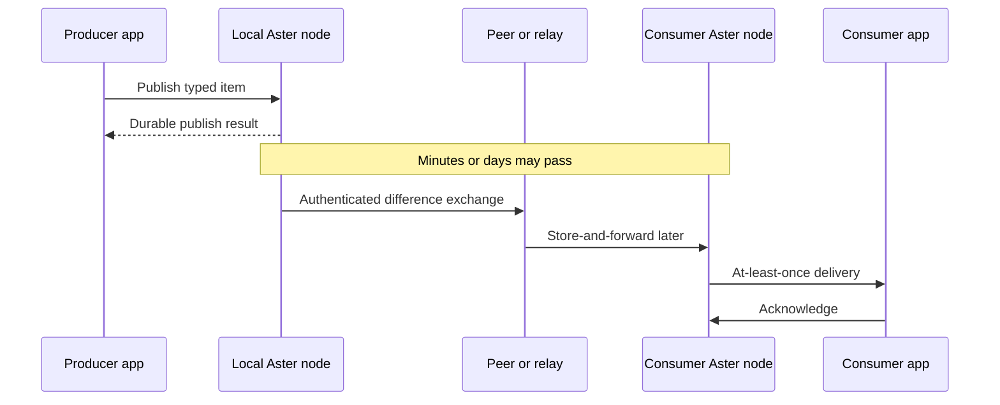

# Core concepts

This guide gives application developers and system integrators the mental model
needed to use Aster correctly. It intentionally avoids wire-format and
implementation detail.

## The one-minute model

An Aster **node** is a durable local participant embedded in or hosted beside
an application. The application publishes typed **items**. Each item belongs
to a named **topic** inside an administrative **scope**.

A publish call commits locally before it succeeds. Later, authorized nodes
authenticate, compare relevant inventories, and transfer differences. A
receiving node verifies and stores an item before exposing it to an
application. Contacts can end at any point; durable progress can resume later.

There is no global coordinator, and correctness does not depend on a wall
clock.

## Anatomy of an item

| Field | Question it answers |
|---|---|
| Data class | How should copies converge? |
| Topic | What kind of application data is this? |
| Scope | Where may it propagate? |
| Logical key | Which entity or stream does it describe? |
| Payload | What application bytes does it carry? |
| Priority | How urgently should constrained resources handle it? |
| TTL | When does it stop being useful? |
| Publisher identity | Who authenticated it at the source? |

Aster treats the payload as bytes; the application owns its schema and
encoding. Aster authenticates the item’s class, topic, scope, priority, TTL,
and publisher identity.

### Topic, scope, and logical key are different

- A **topic** groups the same kind of data. Subscribers ask for topics.
- A **scope** is a propagation and authorization boundary. Reusing a topic in
  two scopes does not connect them.
- A **logical key** identifies the subject within a topic. State and Record
  normally reuse it for successive versions of one object; Event may use it to
  name a stream without replacing earlier entries.

Topics are 1–128 bytes and use letters, numbers, `.`, `_`, and `-`. Scopes are
also 1–128 bytes and additionally allow `/` for hierarchy. Empty, `.`, and
`..` scope segments are invalid.

## Choosing a data class

Choose according to how disconnected updates should behave, not payload size
alone.

| Class | Use it for | Disconnected-update behavior |
|---|---|---|
| **State** | Replaceable current values such as position, health, or active configuration | Sequential values supersede; concurrent values converge to one deterministic projection while losing versions remain recoverable |
| **Event** | Immutable messages, observations, audit records, or samples | Every entry remains; each publisher has a durable sequence and receivers can inspect gaps |
| **Record** | Plans, forms, and other documents edited by disconnected writers | Concurrent siblings remain until the application resolves an exact current head set; a stale resolution guard fails |
| **Blob** | Large immutable imagery, maps, attachments, or models | Authenticated partial transfer may resume, but incomplete content stays hidden; identity includes content and manifest choices |

Blob content uses streaming or file APIs; generic publish rejects it. Record
replication never executes application merge code automatically. Event has no
global ordering authority across publishers.

## Framework mechanisms

### Offline-first publication

A successful publish result means the item and its local causal metadata are
durably committed. It does not mean another node received the item. This lets
the same application work online, through relays, or while disconnected.

Publisher counters must never roll backward. A node that loses its complete
store and anti-rollback state must be reprovisioned with a new identity.

### Query versus subscription

- A **query** returns a bounded view of data already stored locally. It does not
  contact peers.
- A **subscription** is a durable at-least-once delivery cursor. Process each
  delivery idempotently and acknowledge only after committing the application
  result.

Stopping before acknowledgement may produce another attempt. Use the stable
delivery identity for application deduplication.

### Causality and conflicts

Aster records causal relationships explicitly; wall-clock timestamps never
decide whether one update supersedes another.

- State projects one deterministic current version.
- Event is append-only and detects per-publisher gaps.
- Record preserves concurrent heads for guarded application resolution.
- Blob is immutable and does not merge.

### Deletion with tombstones

A deletion in the broader semantic `ApplicationNode` API is a replicated
tombstone, not a local row removal. It prevents an offline node from
reintroducing an older value only within the configured retention window. The
default for that store is 45 days: 30 days of offline tolerance plus a 15-day
margin. Returning after that boundary can resurrect data.

Configure tombstone and superseded-version retention through
[`ApplicationNodeOptions`](../crates/aster-core/src/api.rs) and align it with
the deployment’s actual offline tolerance.

The selected runtime does not yet provide retention-driven State, Record, or
Blob garbage collection. See the
[current implementation boundary](../README.md#current-implementation-boundary).

### Priority and TTL

Priority and time-to-live answer different questions:

- **Priority** selects scheduling and storage-pressure intent: Routine,
  Priority, Immediate, or Flash.
- **TTL** says how long a non-tombstone item remains useful. Expired data must
  not be forwarded and enters garbage collection.

A high-priority item may still expire quickly. A low-priority item may be
durable. Applications should choose both explicitly. Finite TTL is currently a
selected Linux Event capability; selected State, Record, and Blob remain
durable-only. See the normative [TTL rules](protocol.md#10-ttl-and-freshness-without-synchronized-clocks).

### Emission policy

`AtLeast(priority)` withholds selected Events below the threshold while still
allowing contacts and required protocol work. `ReceiveOnly` initiates no
contacts and discloses no local inventory or items, while accepting eligible
inbound synchronization and its mandatory transport acknowledgements.

These policies restrict use of existing authorization; they never broaden it.
`ReceiveOnly` is not a physical radio-silence guarantee.

### Bounded storage and backpressure

Configured limits bound stored items, bytes, staging, subscriptions, and
in-flight work. Capacity errors are policy or resource signals, not transient
network failures. Current class-specific eviction and deferral behavior is
documented in [Architecture](architecture.md) and the
[protocol](protocol.md#11-priority-retry-eviction-and-emissions).

### Atomic batches

The broader semantic `ApplicationNode` API supports an explicit batch of 2–64
ordered items with one publisher, data class, topic, scope, and active epoch.
Either every member commits or none does. Blob batches atomically finalize
distinct streaming writers without exposing manifests or route commitments to
application code.

## Routing and propagation

### Contacts and carriers

A **carrier** moves opaque fragments over IP, BTLE, or another narrow link
adapter. It does not define item meaning, encryption, reconciliation, or
conflict behavior.

A **contact** is one authenticated synchronization session. Deployment
configuration chooses carriers; individual publish calls do not. See
[Carriers and contacts](transports.md).

### Relays and bridges

A relay stores and forwards within authorized scopes and may have routing
access without content access. The source-authenticated item remains unchanged
across relay hops.

A bridge moves explicitly selected data across a directed scope boundary. Its
authority fixes allowed topics, priorities, target scope, and hop limit. A
bridge may narrow this policy but cannot broaden it, and a target reader still
needs content authorization for the origin data.

### Provisioning, epochs, and rekey

An authority-issued provisioning artifact supplies node identity and permitted
scope/topic access. Checked-in quickstart artifacts are disposable test inputs,
not an operational provisioning workflow.

Routing access and content access are separate. Rekeying creates a new epoch
and recipient set so removed nodes can be excluded from future data. The
high-level API keeps keys and sealed control objects out of application code;
supported production issuance, custody, recovery, and destruction workflows
remain open.

## Security boundaries in plain language

- Delivered items are encrypted and authenticated at their source.
- Contacts mutually authenticate before replication.
- Carriers move opaque Aster fragments, not plaintext application payloads.
- Relays may route data they cannot decrypt.
- Encryption does not hide endpoints, timing, packet sizes, RF energy, or the
  existence of Aster traffic.
- Current cryptographic mechanisms do not imply FIPS 140-3 validation or
  production authorization.

Read [Security](security.md) for the threat model, implemented controls, and
open deployment gates.

## Next steps

- Choose an operation in [Application recipes](application-recipes.md).
- Run a [quickstart](quickstart/README.md).
- Read the normative [protocol](protocol.md) for interoperability work.
