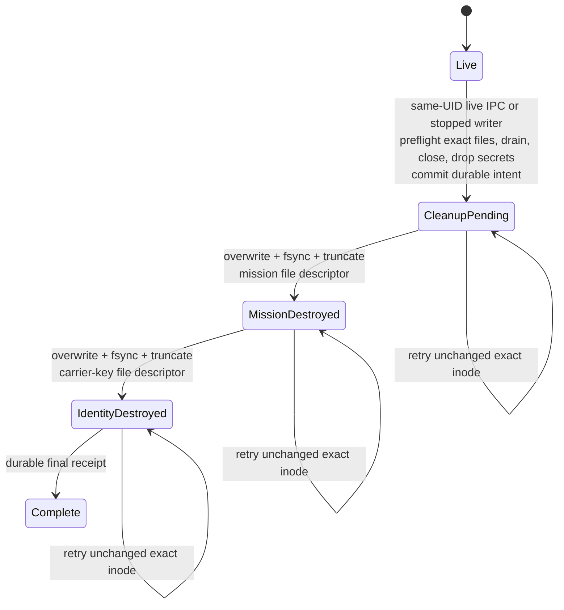

# Live mesh CLI quickstart

This quickstart runs the selected production-implementation lane: real operating
system processes, direct Iroh connections, independent redb stores, an
`aster-core` hybrid-PQ mission session, source-sealed control/Event transfer,
and live Ping/Pong application reaction. The explicit control scenario also
exercises durable revocation, recipient-filtered rekey, and captured-node
exclusion. It is not a mock or a research evaluator.

The boundary matters. Iroh authenticates the carrier endpoint; it does not
authorize the mission or the data. The selected node authenticates the separate
mission `NodeId` before loading or disclosing inventory. It authenticates and
activates the contiguous mission-control prefix before Event, then
authenticates each Event's source and protected metadata through the existing
`aster-core` envelopes. A successful run remains bounded to Event, one sample
topic/scope, durable `ttl=None`, direct loopback, and unprotected reference
provisioning. The selected live Event handle is documented separately; this CLI
tour uses built-in roles and does not turn last-contact status into a global
convergence claim. State, Record, Blob, finite-TTL custody, and other carrier
paths are outside this walkthrough.

## Prerequisites

The repository pins Rust 1.97.1 and the workspace MSRV is Rust 1.91. The
selected CLI currently requires Unix, and its local demonstrations require UDP
loopback binding. Install the pinned tools:

```sh
mise install
```

For the shortest first success, use the one-command
[capability tour](capability-tour.md). This guide keeps the complete operator
and phase detail.

| Goal | Command | Shape |
|---|---|---|
| Fastest causal round trip | `mise run tour` | 2 nodes, 5 cohorts, 8 children |
| Payload-blind relay | `mise run tour-relay` | 3 nodes, 7 cohorts, 13 children |
| Revocation and rekey | `mise run tour-control` | 4 roles, 23 children |

## Run three nodes

Use a new child beneath a temporary directory because `aster demo` refuses to
reuse an existing root:

```sh
ASTER_DEMO_PARENT="$(mktemp -d)"
cargo run --locked -p aster-node --bin aster -- \
  demo --nodes 3 --root "$ASTER_DEMO_PARENT/mesh"
```

The demo accepts 2 through 32 nodes. It creates a line, so with three nodes the
only configured edges are `0↔1` and `1↔2`. Endpoints receive the
`demo/mesh` route grant and `mesh.ping-pong` content grant; intermediates receive
only the route grant.

The command performs `2N+1` bounded cohorts and `5N-2` child-process
executions:

Before those cohorts, the demo seeds one durable receive selector per node and
prints a summary like:

```text
SUBSCRIPTIONS status=seeded consume=2 carry=<N-2> selectors=<N> interest_exchange=mission-protected lanes=receiver-directed
```

Endpoints use `Consume`; route-only intermediates use `Carry`. Each contact
exchanges those interests inside the authenticated mission session and runs a
separate reconciliation lane for each receiver. Empty interest is
receive-none. The selector narrows inventory and transfer but never replaces
fresh source, epoch/revocation, or route authorization.

1. Node 0 runs alone in `ping-publish` with no configured peer or contact. Its
   live `ping-emitter` reserves a durable Event sequence/dot, source-seals Ping,
   content-verifies it, and commits the exact representation plus
   semantic/operation indexes atomically.
2. Each forward edge gets a separate two-process
   `ping-forward-<left>-to-<right>` cohort. Before contact, the left store has
   exactly one Event transfer the right store lacks; the contact moves that one
   pre-existing representation. All six control counters remain zero, and no
   application emits inside a transfer cohort.
3. The final node runs alone in `pong-publish`, with Ping already durable and
   no configured peer or contact. Its `pong-responder` content-verifies Ping and
   atomically commits Pong under an operation key bound to Ping's authenticated
   semantic identity. Pong's causal context observes Ping.
4. Each reverse edge gets its own two-process
   `pong-return-<right>-to-<left>` cohort. Each contact moves exactly the one
   pre-existing Pong difference, all control counters remain zero, and no
   application emits.
5. The full line restarts in `noop`. Both endpoint operations report
   `Existing`; every passing contact reports zero for all six control and all
   five Event reconciliation counters.

A three-node pass ends with output shaped like this; IDs vary because sealed
representations and provisioned identities are fresh:

```text
PHASE status=pass name=ping-publish processes=1 carrier_authenticated_edges=not-applicable mission_authenticated_edges=not-applicable provisioning=unprotected-reference
PHASE status=pass name=ping-forward-0-to-1 processes=2 carrier_authenticated_edges=verified mission_authenticated_edges=verified provisioning=unprotected-reference
PHASE status=pass name=ping-forward-1-to-2 processes=2 carrier_authenticated_edges=verified mission_authenticated_edges=verified provisioning=unprotected-reference
PHASE status=pass name=pong-publish processes=1 carrier_authenticated_edges=not-applicable mission_authenticated_edges=not-applicable provisioning=unprotected-reference
PING status=received emitted_by=origin-process producer_state=node-0 destination_state=node-2 transfer_id=<exact-envelope-sha256> semantic_id=<source-item-id> producer_process_absent=true source_authenticated=true ttl=none
PHASE status=pass name=pong-return-2-to-1 processes=2 carrier_authenticated_edges=verified mission_authenticated_edges=verified provisioning=unprotected-reference
PHASE status=pass name=pong-return-1-to-0 processes=2 carrier_authenticated_edges=verified mission_authenticated_edges=verified provisioning=unprotected-reference
RELAY status=pass intermediates=1 exact_forward=true content_access=denied semantic_acceptance=none
PONG status=received emitted_by=destination-process producer_state=node-2 destination_state=node-0 correlation_semantic_id=<ping-semantic-id> transfer_id=<exact-envelope-sha256> semantic_id=<pong-semantic-id> source_authenticated=true causal_observation=verified ttl=none
PHASE status=pass name=noop processes=3 carrier_authenticated_edges=verified mission_authenticated_edges=verified provisioning=unprotected-reference
DEMO_RESULT status=pass scenario=ping-pong nodes=3 processes=13 contacts=real-iroh mission_auth=hybrid-pq provisioning=unprotected-reference stores=independent-redb reconciliation=negentropy producer_process_absent=true restarts=pass atomic_reaction=pass equal_inventory_noop=pass transfers_each=2 semantics=source-authenticated-event emitted_by=running-node-processes payload_blind_relays=pass ttl=durable-none root=<demo-root>
```

`transfer_id` is the SHA-256 identity of the exact randomized sealed bytes. It
is intentionally distinct from `semantic_id`, the source-envelope `ItemId`.
Reconciliation and Fetch/Offer use the exact transfer identity; semantic
acceptance, causality, and application correlation use authenticated semantic
identity and header fields.

Every child writes stdout and stderr under `<demo-root>/logs`. Direct attempts
that race peer startup, concurrent contact, or planned shutdown remain visible
in `.err` files. The scheduler retries eligible contacts while a cohort is
active. A terminal pass requires successful child exits, exact endpoint/cache
state, one live emission of each application event, durable `Existing` on
restart, and an equal-inventory no-op. It does not require or claim zero failed
contact attempts.

Inspect both stopped endpoints and the relay:

```sh
cargo run --locked -p aster-node --bin aster -- \
  inspect --state "$ASTER_DEMO_PARENT/mesh/node-0"
cargo run --locked -p aster-node --bin aster -- \
  inspect --state "$ASTER_DEMO_PARENT/mesh/node-1"
cargo run --locked -p aster-node --bin aster -- \
  inspect --state "$ASTER_DEMO_PARENT/mesh/node-2"
```

For N=3 the endpoints report `opaque_items=0 events=2
event_acceptance_markers=2 route_cached_events=0`. The intermediate reports
`opaque_items=0 events=0 event_acceptance_markers=0 route_cached_events=2`.
Exact sealed-byte totals match even though the relay has no semantic row.

## Run the four-role control scenario

The control acceptance path is explicit and requires exactly four nodes. Plain
`demo --nodes 4` remains Ping/Pong; select controls with:

```sh
ASTER_CONTROL_PARENT="$(mktemp -d)"
cargo run --locked -p aster-node --bin aster -- \
  demo --nodes 4 --scenario control --root "$ASTER_CONTROL_PARENT/mesh"
```

The roles are authority/member node 0, route-only node 1, surviving member node
2, and captured member node 3. Two short-lived authority CLI processes commit a
generation-one revocation for node 3 and a recipient-filtered transition of
`demo/mesh` to epoch two. The demo then runs this bounded sequence:

1. Node 0 gives the exact two-control Flash suffix to node 1.
2. Both the authority CLI and node 0's carrier process exit. Node 1 forwards the
   suffix without content access; node 2 atomically activates it.
3. Node 2 then runs alone with `peers=0` and `contacts=0` and atomically commits
   epoch-two Ping. A separate following node-1/node-2 cohort transfers that one
   exact Event. This is the deterministic barrier between control convergence,
   local publication, and later forwarding.
4. Two later node-2/node-3 cohorts must fail. Node 3 receives no control or
   epoch-two Event, and its stale epoch-one Ping is not admitted by node 2.
5. Nodes 0 and 1 start with relay applications. That cohort delivers the
   already-durable Ping from node 1's route-only cache to eligible member node
   0 and exits before application reaction is required.
6. Node 0 runs alone with `peers=0` and `contacts=0`, observes its durable Ping,
   and atomically commits causally correlated epoch-two Pong.
7. Nodes 0 and 1 move the already-durable Pong into node 1's payload-blind
   route cache, then exit.
8. Nodes 1 and 2 move that already-durable Pong to node 2 and exit. Each of the
   three transfer cohorts reconciles one pre-existing Event difference, with
   all control counters zero.
9. Eligible nodes 0–2 restart to an equal-inventory no-op. Every passing
   contact reports zero for `control_offered`, `control_fetched`,
   `control_retained`, `control_duplicates`, `control_activated`,
   `control_remaining`, `offered`, `fetched`, `inserted`, `duplicates`, and
   `remaining`.

A pass ends with these invariant summaries:

```text
CONTROL_RESULT status=pass nodes=4 authority_processes=2 controls=2 control_priority=flash authority_absent_forwarding=pass route_only_forward=pass survivor_epoch=2 captured_node=3 captured_sync=denied captured_epoch2_read=denied captured_mesh_publication=denied captured_rejoin=denied captured_local_signing=stale-only commit_before_activate=true mission_auth=hybrid-pq root=<demo-root>
DEMO_RESULT status=pass scenario=control nodes=4 processes=23 contacts=real-iroh mission_auth=hybrid-pq provisioning=unprotected-reference stores=independent-redb reconciliation=negentropy authority_absent_during_forwarding=true authority_cli_absent_after_commit=true authority_carrier_restart=pass controls=source-authenticated-flash recipient_filtered=true payload_blind_relay=pass captured_exclusion=pass epoch2_ping_pong=pass restarts=pass atomic_reaction=pass equal_inventory_noop=pass eligible_transfers_each=2 epoch2_publisher=node-2 root=<demo-root>
```

`captured_local_signing=stale-only` means the captured node retains old local
signing material: exclusion is not secret destruction. The demo also keeps its
authority and node bundles as raw unprotected-reference files.

The separate local hook below can destroy one selected node's retained secret
file contents. It does not change this control flow.

## Run manually addressed processes

The same binary can run separately managed nodes on directly routable systems.
Unlike `demo`, manual commands do not issue credentials. An operator must supply
a separate reference mission bundle with the needed route/content grants and
the exact mission `NodeId` for each peer. There is intentionally no production
provisioning CLI or admitted at-rest provider yet.

Create an independent state root on each system:

```sh
cargo run --locked -p aster-node --bin aster -- init --state ./aster-state
```

Record the carrier endpoint ID printed by `INIT`. Start both nodes with the
other side's exact carrier identity, reachable address, and independent mission
`NodeId`:

```sh
# System A; sample application role is optional
target/debug/aster node --state ./aster-state --bind 0.0.0.0:49100 \
  --mission-bundle-unprotected-reference "$SYSTEM_A_MISSION_BUNDLE" \
  --peer "$SYSTEM_B_ID@$SYSTEM_B_IP:49100=$SYSTEM_B_MISSION_ID" \
  --sync-ms 500 --application ping-emitter

# System B
target/debug/aster node --state ./aster-state --bind 0.0.0.0:49100 \
  --mission-bundle-unprotected-reference "$SYSTEM_B_MISSION_BUNDLE" \
  --peer "$SYSTEM_A_ID@$SYSTEM_A_IP:49100=$SYSTEM_A_MISSION_ID" \
  --state-interest sensors@mission/alpha \
  --record-interest reports@mission/alpha \
  --blob-interest blobs@mission/alpha \
  --sync-ms 500 --application pong-responder
```

`--state-interest TOPIC@SCOPE`, `--record-interest TOPIC@SCOPE`, and
`--blob-interest TOPIC@SCOPE` are repeatable, class-separated receive interests
for already durable source objects. Blob is opt-in only in semantic v5 and its
selector is an exact topic/scope pair, not a descendant or wildcard match.
Empty means receive-none. These selectors do not grant route or content access;
the mission bundle must independently authorize the exact source, topic,
scope, and current epoch. Eligible semantic-v5 direct-Iroh contacts
automatically reconcile Blob sources and peer-neutral contiguous carrier ranges
of at most 16 KiB.

Any stopped State/Record/Blob facade must be closed before the runtime owns the
same store. Rust applications may instead call
`RunningNode::selected_state()`, `RunningNode::selected_records()`, and
`RunningNode::selected_blobs()` for cloneable live handles backed by that
actor's bounded application lane. Live Blob publish accepts an already-open
regular nonempty file at cursor zero, with a 64-MiB/1,024 canonical 64-KiB
chunk ceiling; a live page read returns at most 64 KiB in zeroize-on-drop
plaintext after fresh source, policy/lineage, and exact authenticated depot
completion checks. The CLI does not expose these handles as language bindings,
and its built-in roles neither publish nor read Blob. Record network ingest
retains concurrent revisions and never executes application merge code.

State's live Rust handle additionally exposes durable positive-current-version
subscription, poll, acknowledgement, and unsubscribe operations. Application
subscriptions do not mutate the configured network interests.

The built-in application roles require bundles granting scope `demo/mesh`, key
epoch 1, and topic `mesh.ping-pong` to the endpoint applications. A relay role
requires only the scope/epoch route grant. This manual shape is documentation of
the process interface, not an operational provisioning workflow.

The Iroh handshake binds the expected endpoint and rejects an unlisted carrier
before an application frame. The node then runs the hybrid reference session,
checks the configured mission `NodeId`, reconciles and activates the contiguous
source-authenticated control prefix, and only then constructs the peer-filtered
Event inventory. A pending control gap defers all data lanes. Every later
mechanics frame is protected and replay-checked. An authenticated peer without
the current scope/epoch route grant learns no matching Event, State, or Record
ID and cannot Fetch or Offer it; a durably revoked mission principal is
rejected.

Without controlled-relay flags, hosted discovery, Iroh relays, and port mapping
are disabled. Direct IP reachability and firewalls are operator
responsibilities. Manual mission bundle files must be regular, bounded,
non-symlink files with owner-only Unix permissions. CLI output labels this mode
`provisioning=unprotected-reference`.

### Trigger bounded local software zeroization

This operation is intentionally destructive. On Unix, the same effective-UID
operator can target the exact initialized state and the exact mission bundle
used by that node:

```sh
target/debug/aster zeroize --state ./aster-state \
  --mission-bundle-unprotected-reference "$SYSTEM_A_MISSION_BUNDLE" \
  --wait-seconds 120
```

If `aster node` owns the state, the command connects to an owner-only local Unix
socket bound to the state directory and redb file identities. The runtime stops
starting work, closes every application admission surface, joins the bounded
Blob worker, drains its owned contact tasks, closes and drops the Iroh endpoint,
and drops derived secret holders before entering the terminal store lifecycle.
If no node is live, the same command acquires the exclusive redb writer and
follows the stopped-state path. A live writer with no matching local
zeroization endpoint is rejected rather than forced.

Before the irreversible transition, both secret artifacts must be owner-only,
regular, non-symlink files owned by the effective UID, with exactly one hard
link and an exclusive advisory lock. The store then commits a mission-bound
terminal intent containing only bounded pathname/device/inode/length
descriptors. Through each already retained file descriptor, the runtime
overwrites the original contents with zero bytes, calls the durable file-sync
boundary, truncates the same inode to zero length, and synchronizes it again.
It does not unlink either pathname. Successful output is shaped like:

```text
ZEROIZE status=pass mode=live state=complete mission_destroyed=true carrier_identity_destroyed=true mission_pathname=retained-zero-length carrier_identity_pathname=retained-zero-length data_rows_preserved=true opaque_items=<n> events=<n> route_cached_events=<n> controls=<n> assurance=bounded-software physical_sanitization=not-claimed local_authority=same-uid-operator state_root=<state-root>
```

The node emits `STOP lifecycle=zeroized sync_status=terminal-lockout`. `aster
inspect` remains available and reports `zeroization=complete`; normal `init`,
`node`, `put`, and authority/store opens fail closed while the retained redb
marker exists. Application, Event, State, Record, Blob, route-cache, and control
rows are deliberately preserved for audit, as is the encrypted Blob depot.
Erasing the mission/content and carrier-identity secrets makes that ciphertext
unavailable through normal operation: this is bounded cryptographic shredding,
not deletion or physical sanitization of depot files. Restoring credential
bytes into the retained zero-length files does not reopen that same database.
Replacing or rolling back the database is outside the supported boundary.

Cleanup is idempotent and crash-resumable after the terminal marker: only an
uncompleted pathname that still identifies the exact recorded inode may be
reopened and erased. A missing, replaced, linked, symlinked, permission-changed,
or otherwise indeterminate target leaves the store terminal and fails closed;
the retry never erases replacement data.

The boundary stops at bounded local Unix software erasure. The CLI has no network
or mission-control trigger and does not prove inode deletion, deterministic
remote observation of a mid-flight teardown, physical flash sanitization,
copy-on-write history removal, snapshot/swap/backup destruction, database
rollback resistance, non-Unix behavior, protected provisioning, or independent
platform assurance.



Every non-`Live` phase denies normal opens. Terminal-safe inspection and
preserved data rows remain available while an unchanged exact-inode cleanup can
resume after a crash.

### Publish a control from a stopped authority state

The bounded authority commands open the same exact redb store as `aster node`.
Stop every node process using that `--state` path before invoking them. The
OS-backed exclusive writer lock rejects an authority command while the node is
live; after a successful commit, restart the node to propagate the control.

The authority bundle must already contain the mission's control-authority
capability. Revoke one mission principal at a nonzero generation:

```sh
target/debug/aster control-revoke --state ./aster-authority-state \
  --mission-bundle-unprotected-reference "$ASTER_CONTROL_AUTHORITY_BUNDLE" \
  --subject "$CAPTURED_MISSION_NODE_ID" --generation 1
```

Rekey one scope from an already signed public registry. Recipient identities are
mission `NodeId` values, not Iroh endpoint IDs; members also name their granted
topics:

```sh
target/debug/aster control-rekey --state ./aster-authority-state \
  --mission-bundle-unprotected-reference "$ASTER_CONTROL_AUTHORITY_BUNDLE" \
  --signed-public-registry "$ASTER_SIGNED_PUBLIC_REGISTRY" \
  --minimum-registry-generation 4 \
  --scope demo/mesh --epoch 2 \
  --route-recipient "$RELAY_MISSION_NODE_ID" \
  --member-recipient "$MEMBER_A_MISSION_NODE_ID=mesh.ping-pong" \
  --member-recipient "$MEMBER_B_MISSION_NODE_ID=mesh.ping-pong"
```

These commands reserve, source-seal, reverify, durably commit, and only then
activate an idempotent chained control. They do not generate an authority bundle
or signed public registry. This repository does not yet provide the protected
registry/bundle issuance, custody, recovery, or operator-authorization workflow
needed for production administration.

`aster put` remains an isolated caller-ID opaque compatibility command. Those
rows are inspectable but are not advertised or transferred by selected Event
reconciliation. Do not use `put` for source-authenticated mesh data.

## What this implementation owns

| Component | Sole responsibility in the selected lane |
|---|---|
| `aster-profile` | Stable complete reconciliation keys and canonical inventory ordering; class-specific exact Event/State/Record transfer IDs enter by explicit conversion |
| `aster-redb-store` | Mission-bound audited control chain and atomic policy snapshots plus semantic Event/State/Record/Blob causal/operation state, durable Event, positive-current-version State, whole-key active-head Record, and metadata-only Blob publication delivery state, bounded Event route-only cache, durable terminal software-zeroization state, and a disjoint opaque compatibility namespace |
| `aster-negentropy` | Bounded, clock-independent set difference over exact transfer IDs |
| `aster-iroh` | Direct and operator-pinned controlled-relay endpoint lifecycle, carrier identity, and bounded exchange |
| `aster-node` | Composition, mission-before-inventory and control-before-data ordering, peer route/interest filtering, exact control/Event/State/Record transfer, semantic-v5 direct Blob source/range automation, live Event/State/Record/Blob handles, durable application delivery, authority commands, sample applications, bounded same-UID Unix local zeroization lifecycle, and CLI |
| `aster-core` | Existing spec-verified hybrid mission session, control envelope, recipient-filtered rekey, and typed source-envelope Event/State/Record/Blob semantics, used rather than rewritten |

Current validation coverage and open product gates are tracked in
[requirements status](../validation/requirements-status.md) and
[conformance](../validation/conformance.md).
