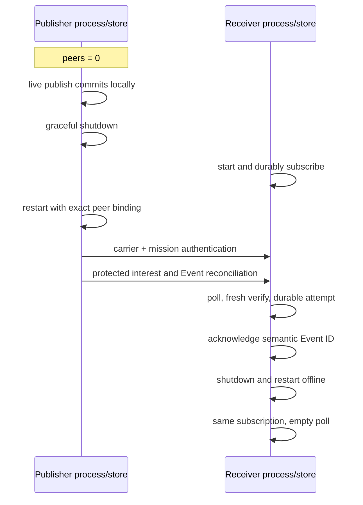
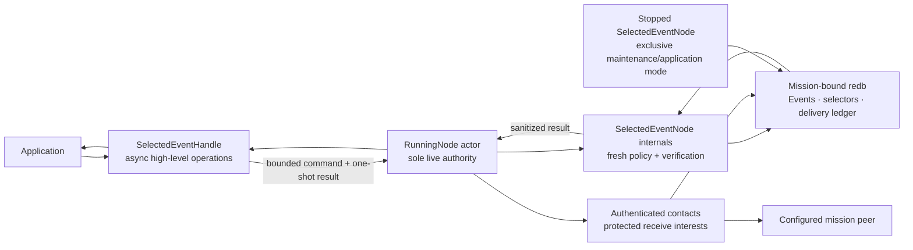

# Selected Event API quickstart

This is the shortest application-code path into the **selected production-lane
store, runtime, and security composition**. The live API starts the sole node
actor, publishes while no peer is configured, queries and consumes the durable
Event locally, inspects authenticated stream gaps and contact status, and shuts
down cleanly. Application code does not construct envelopes, select
cryptography, inspect sealed bytes, choose a carrier, or drive reconciliation.

The selected Event surface now provides live and stopped-state publish, bounded
query, durable subscribe/poll/ack, idempotent unsubscribe, and authenticated gap
inspection. A live `SelectedEventHandle` additionally reports bounded peer and
last-contact Event status while the actor owns the store. That status is not a
State, Record, or Blob convergence signal. Subscriptions do not update
atomically: changing one requires an unsubscribe followed by a subscribe. The
stopped `SelectedEventNode` and `SelectedControlAdmin` accept protected
artifacts or exact opaque secret references. Caller-provided Rust `NodeConfig`
construction now accepts the same sources, and a running authority exposes the
typed `SelectedControlHandle`; those bounded Rust-only seams are documented
below. Linux semantic-v3-format finite Event TTL is documented in the
[selected custody quickstart](selected-custody-api.md).

With semantic v7, exact durable, finite-TTL, tombstone, route-only, mixed, and
bounded blind ReceiveOnly Event traffic synchronizes as receipt-free pages after
per-lane profile negotiation. Finite entries retain authenticated cumulative
age without per-peer receipt, lease, suppression, or retry state. Publish still
completes at the local durable commit and never waits for this synchronization.
Only peers that do not share `EventPagesV1` use the complete legacy Event
mechanics. Contact/page counters describe attempts and durable local application,
not proof that a remote application consumed data.

## Run the live example

Install the pinned toolchain, then create a disposable two-node fixture. The
demo finishes and releases both stores before the application example opens
node 0. The example deliberately configures no peers, so its publication and
application delivery succeed offline through the running actor.

```sh
mise install
ASTER_EVENT_ROOT="$(mktemp -d)"
cargo run --locked -p aster-node --bin aster -- \
  demo --nodes 2 --root "$ASTER_EVENT_ROOT/mesh"

cargo run --locked -p aster-node --example live_event_application -- \
  "$ASTER_EVENT_ROOT/mesh/node-0" \
  "$ASTER_EVENT_ROOT/mesh/node-0/mission.unprotected-reference.bundle" \
  demo/mesh mesh.ping-pong --initialize-publication-journal
```

Among the runtime lifecycle lines, expect one application line shaped like:

```text
LIVE_EVENT id=<64 hex characters> inserted=true query_items=<n> deliveries=<n> gaps=0 scanned_through=<n> sync=Offline
```

`query_items` and `deliveries` can exceed one because the disposable demo
already populated the topic. The example filters its query to the local
publisher, acknowledges every returned delivery, reports only gaps anchored by
freshly verified local observations, unsubscribes, and gracefully shuts down.

For subsequent runs, omit `--initialize-publication-journal`. The example opens
its existing private journal, fences the previous session, and recovers a pending
full intent before new work. A failed or uncertain publication stays pending;
repair it rather than deleting the journal or changing the client identity.
Each completed run allocates the next sequence and publishes a new Event. The
subscription still uses a stable selector key and is removed at shutdown.

The fixture persists explicitly unprotected reference mission bundles. They are
suitable for this disposable demonstration, not operational provisioning.
Remove the temporary directory when you no longer need it.

## Start a live node with protected provisioning

An embedding Rust application can construct the live configuration before
calling `start_node` without placing an unprotected-reference bundle on the
stock CLI path:

```rust
use aster_mesh::{
    ProvisioningLoadId, ProvisioningSecretLoader, ProvisioningSecretRef,
    ProvisioningUnprotector,
};
use aster_node::{NodeBootstrapError, NodeConfig, NodeConfigOptions};
use std::{net::SocketAddr, path::Path, time::Duration};

fn from_protected_file<P: ProvisioningUnprotector + ?Sized>(
    state: &Path,
    artifact: &Path,
    bind: SocketAddr,
    provider: &mut P,
) -> Result<NodeConfig, NodeBootstrapError> {
    NodeConfig::open_protected(
        state,
        artifact,
        NodeConfigOptions::new(bind, Duration::from_millis(500)),
        provider,
    )
}

fn from_secret_ref<L: ProvisioningSecretLoader + ?Sized>(
    state: &Path,
    secret_ref: &ProvisioningSecretRef,
    operation: ProvisioningLoadId,
    bind: SocketAddr,
    loader: &mut L,
) -> Result<NodeConfig, NodeBootstrapError> {
    NodeConfig::open_secret_ref(
        state,
        secret_ref,
        operation,
        NodeConfigOptions::new(bind, Duration::from_millis(500)),
        loader,
    )
}
```

`NodeConfig::from_protected_bytes` is the corresponding caller-supplied byte
entry point. `NodeConfigOptions` fixes the complete bounded mission-independent
configuration before provider access. Invalid options and terminal state fail
before a provider call or state creation; a passing provider/loader is invoked
once, and rejection never falls back to plaintext parsing.

Relative paths are resolved once against a captured absolute current directory.
The config then retains the exact absolute lexical state pathname and rejects a
later mutation before state creation. That witness does not bind an inode,
parent directory, symlink resolution, later rename, store replacement, or
rollback history. Runtime `READY` and `STOP` lines report only
`provisioning=provider-protected-artifact` or
`provisioning=provider-secret-reference`.

This is a caller-provided Rust bootstrap seam. The repository does not ship a
production provider, SecretStore, issuance/recovery workflow, protected stock
CLI startup, or selected-node binding. The recovered canonical bundle remains
zeroizing plaintext in the process. Protected and secret-reference nodes support
graceful `RunningNode::shutdown`, but the same-UID local software-zeroization
hook cannot destroy provider custody or coordinate a provider destroy receipt.

## Open a stopped surface with protected provisioning

When no live actor owns the state, `SelectedEventNode` offers four explicit
provisioning modes:

```rust
use aster_mesh::{
    ProvisioningLoadId, ProvisioningSecretLoader, ProvisioningSecretRef,
    ProvisioningUnprotector,
};
use aster_node::application::{ApplicationError, SelectedEventNode};
use std::path::Path;

fn open_protected<P: ProvisioningUnprotector + ?Sized>(
    state: &Path,
    artifact: &Path,
    provider: &mut P,
) -> Result<SelectedEventNode, ApplicationError> {
    SelectedEventNode::open_protected(state, artifact, provider)
}

fn open_from_secret_ref<L: ProvisioningSecretLoader + ?Sized>(
    state: &Path,
    secret_ref: &ProvisioningSecretRef,
    operation: ProvisioningLoadId,
    loader: &mut L,
) -> Result<SelectedEventNode, ApplicationError> {
    SelectedEventNode::open_secret_ref(state, secret_ref, operation, loader)
}
```

`from_protected_bytes` is the equivalent bounded in-memory artifact entry
point. `open_unprotected_reference` remains available for fixtures and
migration and says so in its name. `SelectedControlAdmin` exposes the same four
open shapes for stopped authority work.

The state terminal check runs before artifact or provider access. Protected
provider rejection never falls back to canonical plaintext, and errors expose
only stable sanitized categories. A successful opaque-reference load must
return a receipt binding the exact caller operation and reference. The
recovered bundle remains zeroizing plaintext in process; opening does not
destroy the provider secret or coordinate a live drain.

Relative state and file-artifact paths are resolved against one captured
absolute current directory before the provider or loader callback. This avoids
callback-driven current-directory rebinding, but it is not a complete
filesystem identity or rollback guarantee. Unix protected-file checks reject
symlinks and bind the opened file to preflight metadata; equivalent non-Unix
path-swap assurance and deeper parent-directory rename/symlink resistance
remain open.

You supply the protection or SecretStore implementation. The repository has no
production backend, hardware/platform key policy, backup/recovery procedure, or
physical-erasure claim. The age pilot is isolated and non-production, and the
SecretStore fixture tests only the provider contract. The live runtime, CLI,
and C/Go/Python bindings still use the unprotected compatibility path.

## Prove offline publish and later synchronization

On Unix, the focused integration test uses separate operating-system processes
and independent stores. It publishes through the live handle with no peer
configured, stops that process, starts a subscribed receiver, restarts the
publisher with the exact peer binding, receives and acknowledges the Event,
then restarts the receiver and verifies that the acknowledgement remains
durable:

```sh
cargo test --locked -p aster-node --test mesh_cli \
  offline_publish_later_real_process_sync_poll_ack_and_restart -- \
  --exact --nocapture
```



## Use the live API

The complete runnable source is
[`crates/aster-node/examples/live_event_application.rs`](../../crates/aster-node/examples/live_event_application.rs).
Its central shape is:

```rust
let running = start_node(NodeConfig {
    state,
    bind: "127.0.0.1:0".parse()?,
    mission,
    peers: Vec::new(),
    sync_interval: Duration::from_millis(250),
    run_for: None,
    application: NodeApplication::Relay,
})
.await?;
let events = running.selected_events();

let subscription = events
    .subscribe(EventSubscriptionRequest {
        operation_key: b"my-app/ops/consume".to_vec(),
        topic: topic.clone(),
        scope: scope.clone(),
        include_descendant_scopes: false,
    })
    .await?;

let published = events
    .publish(EventPublishRequest {
        operation_key: b"my-app/asset-7/ready".to_vec(),
        predecessor: None,
        topic: topic.clone(),
        scope: scope.clone(),
        priority: Priority::Priority,
        logical_key: b"asset-7".to_vec(),
        payload: b"ready".to_vec(),
        tombstone: false,
    })
    .await?;

let page = events
    .query(EventQuery {
        publisher: Some(events.identity()),
        topic: Some(topic.clone()),
        scope: Some(scope.clone()),
        ..EventQuery::default()
    })
    .await?;

let deliveries = events
    .poll(EventPollRequest {
        subscription: subscription.id,
        delivery_limit: 128,
        scan_limit: 128,
    })
    .await?;
for delivery in deliveries.deliveries {
    events
        .acknowledge(subscription.id, delivery.event.id)
        .await?;
}

let status = events.status().await?;
let gaps = events
    .gaps(EventGapQuery {
        publisher: events.identity(),
        topic,
        scope,
        after_sequence: 0,
        scan_limit: 128,
    })
    .await?;

events.unsubscribe(subscription.id).await?;
running.shutdown().await?;
```

Choose an operation key that identifies the application effect, not a random
attempt. Reusing it with the same publish request returns the original commit;
reusing it with different content fails closed. Topics and scopes must be
authorized by current mission policy. Tombstones must have an empty payload.
The selected Event slice authenticates and returns priority. Semantic-v3/v4/v5
contacts use it for bounded transmission order and retry cadence, while the
selected pressure policy fixes same-scope candidates ahead of off-scope rows
when that exact scope is initially short, then retires expired rows and
route-only rows before comparing priority within each cohort. The additive
`publish_with_options` API accepts a positive
source-authenticated finite TTL on Linux; query, poll, and gap exposure withhold
an Event at the exact expiry boundary. See [Selected Event custody and
constrained operation](selected-custody-api.md) for configuration, clock,
receive-only, quota, compatibility, and claim boundaries. State, Record, and
Blob remain outside this custody path, so generic cross-class priority eviction
is still open.

`EventQuery::before_acceptance_marker` optionally sets an exclusive upper
acceptance-marker bound (`None` is unbounded). Combined bounds scan only
`after_acceptance_marker < marker < before_acceptance_marker`. Explicit zero,
equal bounds, and reversed bounds yield an empty page with the lower marker
unchanged and `has_more = false`. Continuation is restricted to the same upper
bound, not the store's full acceptance history.

`EventQuery::limit` bounds accepted rows **scanned**, not only matching rows
returned. A selective page can therefore contain no items while `has_more` is
true. Continue with its `scanned_through` acceptance marker. Returned items are
active, policy-authorized, and freshly source/content verified; transfer IDs,
sealed bytes, keys, route caches, and reconciliation state are not exposed.
Publisher, topic, scope (including optional descendants), and logical-key
filters first narrow candidates using retained storage metadata. This does not
make that metadata trusted: each candidate is freshly authenticated, checked
against its stored metadata and the query, and subject to current authorization
and TTL checks before return. With no filters, all candidates still undergo
these checks.

A subscription operation key identifies one durable Consume selector. Reusing
the key with the same topic/scope contract returns the same subscription;
changing that contract while it exists fails closed. `scan_limit` bounds
pending plus accepted rows freshly source-verified in a poll, while
`delivery_limit` bounds returned Events. An attempt is incremented durably
before return, so an unacknowledged Event repeats after a process crash.
Acknowledging its semantic Event identity is idempotent.

`unsubscribe` atomically removes the selector and purges its pending and
acknowledgement ledger. Retrying removal returns `AlreadyAbsent`. To change a
selector, unsubscribe and then subscribe to the replacement. Those are two
distinct operations and can create an interval with no receive selector; Aster
does not claim an atomic or seamless subscription update.

## Publish controls through the live actor

When the running mission credential carries control-authority capability, obtain
the distinct authority handle before consuming `running`:

```rust
use aster_node::{RevocationRequest, ScopeRekeyRequest};
use std::num::NonZeroU64;

let controls = running.selected_controls();
let request = RevocationRequest::new(subject, NonZeroU64::new(1).unwrap());
let exact_retry = request;

let receipt = controls.publish_revocation(request).await?;
// If the response is lost after enqueue, retry `exact_retry`, not a new request.
```

`publish_scope_rekey` accepts the same bounded `ScopeRekeyRequest` used by
stopped `SelectedControlAdmin`. Clone that request before awaiting when the
caller must survive cancellation; the clone shares its bounded signed-registry
and recipient buffers. Both operations return only after durable publication
and live policy refresh, or return a sanitized administration error. An
authenticated pending predecessor gap yields `PolicyUnsettled` for a fresh
publication without terminating the actor; an exact already-committed retry can
still recover its historical receipt while policy is deferred.

The control queue holds one command and the actor yields after at most four
control commands so Event/status and network work can progress. Once enqueue
completes, dropping or cancelling the future does not cancel actor-owned work;
the operation may still commit. Retain the exact request and retry it to recover
the idempotent receipt. A self-revocation normally returns its committed receipt
before actor teardown. If that response is lost, the live handles close and the
receipt must be recovered by exact retry through stopped
`SelectedControlAdmin` after teardown with the retained provisioning
capability.

This is process-local Rust control, not cross-process administrator IPC. It does
not discover affected scopes, combine revoke and rekey atomically, issue
credentials or registries, authorize an operator, destroy provider secrets, or
add a protected stock CLI or language binding.

## Interpret gaps conservatively

`EventGapQuery` selects one exact publisher/topic/scope stream. Its
`after_sequence` is exclusive and `scan_limit` bounds accepted positions that
the node freshly source- and content-verifies. Each returned `EventGap` is a
half-open interval `[start_sequence, end_sequence)` anchored by the verified
Event at `end_sequence`. Continue from `scanned_through_sequence`; a full page's
`has_more` is deliberately conservative and can be followed by an empty page.

Gap truth is local and store-ledger anchored. No gap in a page means only that
the freshly verified positions already observed by this mission-bound store
were contiguous over that scanned interval. It does **not** prove that the
publisher has emitted nothing later, that no unseen higher sequence exists, or
that the mesh has converged. A trailing absence without a later authenticated
anchor is not reported as a gap.

## Interpret status conservatively

`SelectedEventStatus` is an in-memory observation of this running actor, not a
durable or global synchronization checkpoint.

| `EventSyncStatus` | Exact meaning |
|---|---|
| `Offline` | No peers are configured. Local publish, query, and delivery still work. |
| `NoActiveConfiguredPeers` | Peers are configured, but current control policy marks all of them revoked. |
| `AwaitingAuthenticatedContact` | At least one active configured peer has not completed an authenticated contact in this process. |
| `LastContactComplete` | Every active configured peer's most recent authenticated contact under the current control/selector policy reported no bounded control or Event work remaining. |
| `WorkRemained` | At least one most recent authenticated contact reported bounded work still remaining. |
| `PolicyChangedSinceContact` | Control state or the durable selector generation changed after at least one peer's most recent authenticated contact. |

Each `AuthenticatedPeerStatus` identifies a mission-authenticated peer, its
process-local completed-contact count, its current active/revoked disposition,
and the result of its last contact. `authenticated_contacts` is the sum of
those observations; `failed_contact_attempts` is a local runtime counter.

`LastContactComplete` is **not** global convergence, current reachability,
durable peer knowledge, or proof that a peer possesses every Event. It reports
only the last bounded negotiation with each currently active configured peer.
Restarting the actor begins a new status observation window.

## One authority, two application modes



The live actor and stopped handle never run as two store authorities. The live
handle sends bounded commands to the actor that already owns the mission-bound
writer. Selector-changing commands serialize against contact policy capture;
query, poll, gap, and status results are freshly policy-bound. Shutdown and
zeroization close handle admission and reject queued work before the actor
releases its authority. The stopped `SelectedEventNode` remains useful when no
runtime owns that same state directory.

The State and Record handles share that bounded application lane. Blob commands
enter the same admission boundary and are then dispatched to one bounded,
joined blocking worker because publication owns a regular file. A live Blob
page contains at most 64 KiB in a private zeroize-on-drop allocation. Graceful
shutdown and zeroization close Blob admission and join that worker before store
authority is released; retained Blob handles then fail with sanitized
`StateUnavailable`. Caller-copied page bytes and caller-owned source files are
outside node zeroization. See the [selected Blob quickstart](selected-blob-api.md)
for the exact cancellation and blocking-filesystem limits.

Operations return a sanitized `ApplicationError`. Use its stable `kind()` for
control flow; raw store tables, transfer identities, source-envelope failures,
carrier errors, and provider internals are deliberately unavailable through
the error or its source chain. The lower-level `aster-redb-store` crate is
unpublished and privileged; its plans are not cryptographic capabilities for
application callers.

The live runtime projects application `Consume` selectors and internal
route-only `Carry` selectors into a canonical protected interest. Empty means
**receive nothing**, never wildcard. Each direction independently intersects
the receiver's interest with current route authority. `Carry` can retain exact
protected bytes without exposing plaintext or creating application delivery;
overlapping `Consume` wins for local delivery.

Continue with the [capability tour](capability-tour.md) for a fast visible mesh,
the [selected architecture](../architecture.md) for the complete authority
split, and the [requirements status](../validation/requirements-status.md)
for exact credited and open obligations.
