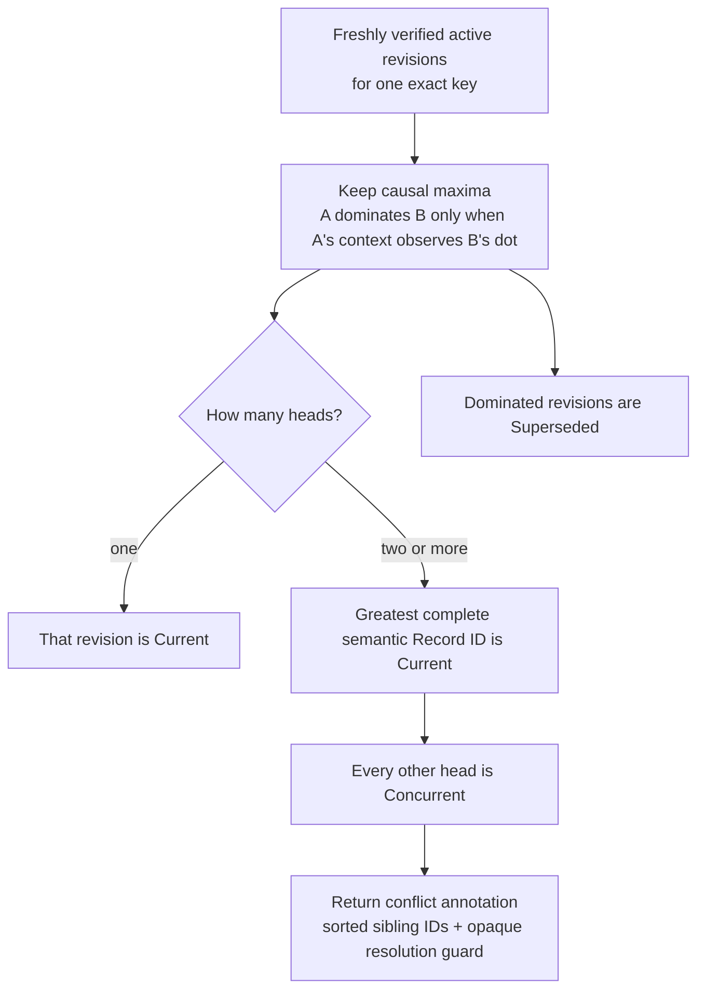
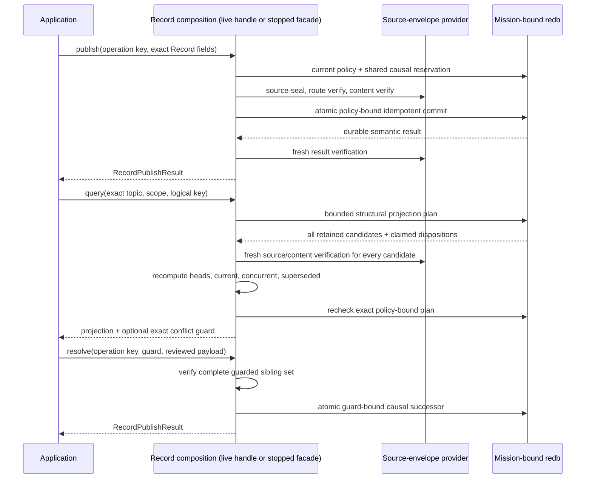

# Selected Record API quickstart

This is the shortest path to Aster's **selected Record conflict projection**. A
running node exposes cloneable async publish/query/resolve and durable
subscribe/poll/acknowledge/unsubscribe operations, while the same composition
retains an exclusive stopped facade for maintenance or applications that do not
need networking. Exact query returns the deterministic current revision,
explicit conflict siblings, and an opaque exact resolution guard. Durable
delivery instead returns one non-authorizing whole-key active-head projection;
an application must issue a fresh exact query before resolving a delivered
conflict. Neither surface exposes envelopes, cryptographic keys, sealed bytes,
or merge execution during ingest.

`RunningNode::selected_records()` returns `SelectedRecordHandle`. Its clones
send commands through the actor's one bounded Event/State/Record lane; they do
not open another store or policy authority. `SelectedRecordNode` remains the
stopped facade and owns the mission-bound writer exclusively. Record reconciles
over a semantic-v4/v5 mission-authenticated, class- and direction-specific
Negentropy lane under exact receiver interests. Ingest never executes registered
merge code, so concurrent heads remain durable and explicit.

Durable whole-key Record delivery has a
[retained bounded receipt](../validation/evidence/selected-live-record-subscription-0c11344.json).
It covers one same-implementation, one-host direct-loopback run, not
selected-node ConnectRPC/C/Go/Python bindings, class-specific status, finite
TTL, expiry, garbage collection, automatic registered-policy merge, broader
relay acceptance, representative physical/mixed-implementation evidence, or
release authorization. The selected store rejects every finite-TTL Record
object; there is no forwarding-age path to enable yet.

## Run the stopped example

Install the pinned toolchain, then create a disposable two-node fixture. The
demo provides a mission bundle and releases its stores before the Record
example opens node 0 exclusively.

```sh
mise install
ASTER_RECORD_ROOT="$(mktemp -d)"
cargo run --locked -p aster-node --bin aster -- \
  demo --nodes 2 --root "$ASTER_RECORD_ROOT/mesh"

cargo run --locked -p aster-node --example record_application -- \
  "$ASTER_RECORD_ROOT/mesh/node-0" \
  "$ASTER_RECORD_ROOT/mesh/node-0/mission.unprotected-reference.bundle"
```

Expect one line shaped like:

```text
RECORD current=<64 hex characters> value=moving counter=<n> ready_inserted=true moving_inserted=true concurrent=0 superseded=1 conflict=false
```

Run the Record example again against the same directory. Both fixed operation
keys resolve their original durable publications, so `ready_inserted=false`
and `moving_inserted=false`; the current semantic identity and value remain
stable. The publisher counter need not start at one because selected Event,
State, and Record publications intentionally share one authenticated causal
counter and frontier.

The fixture persists explicitly unprotected reference mission material. It is
appropriate for this disposable demonstration, not operational provisioning.
Remove the temporary directory when you no longer need it.

For a quick executable conflict proof, run the focused selected-node test. It
constructs three independently source-authenticated heads, proves an ordinary
publish cannot collapse them, resolves the exact guard, retries that operation
after restart, then proves the same operation key cannot resolve a later,
different head set:

```sh
cargo test --locked -p aster-node \
  application::record::tests::n_way_conflict_requires_explicit_guarded_resolution_and_retry_is_stable \
  -- --exact
```

This is an in-process mechanism test over one mission-bound store. The network
test below separately exercises disconnected publishers and a real carrier.

## Use the live actor API

Start a `RunningNode` as shown in the
[selected Event guide](selected-event-api.md), then obtain and clone its Record
handle. Publication, query, and guarded resolution are async because the actor
remains the sole store authority:

```rust
let records = running.selected_records();
let retained = records.clone();

let request = RecordPublishRequest {
    operation_key: b"my-app/record/asset-7/live".to_vec(),
    topic: topic.clone(),
    scope: scope.clone(),
    priority: Priority::Priority,
    logical_key: b"asset-7".to_vec(),
    payload: b"moving".to_vec(),
    tombstone: false,
};
let published = records.publish(request.clone()).await?;
assert!(published.inserted);
assert!(!records.publish(request).await?.inserted); // exact durable retry

let query = RecordQuery {
    topic,
    scope,
    logical_key: b"asset-7".to_vec(),
    include_superseded_versions: true,
};
let projection = records.query(query.clone()).await?;
assert_eq!(projection.current.expect("current Record").id, published.id);

running.shutdown().await?;
let closed = retained.query(query).await.expect_err("actor is closed");
assert_eq!(closed.kind(), ApplicationErrorKind::StateUnavailable);
assert_eq!(closed.operation(), "record query");
```

When `query` returns a conflict, pass its guard to
`records.resolve(resolution_request).await`; the guard and durability semantics
are the same as the stopped example below. Graceful shutdown closes application
admission before releasing the writer. The bounded same-UID Unix zeroization
path does the same before erasing retained secret artifacts. Retained clones
therefore fail closed with sanitized `StateUnavailable`; they never reopen the
store or continue on a stale policy. Event, State, and Record clones share one
bounded command queue and actor-owned policy/store authority.

## Subscribe to whole-key active-head projections

A Record subscription selects a topic and scope, optionally including
descendant scopes. Each delivery is one complete exact-key active-head
projection, not one Record version. `delivery_limit` therefore counts logical
key projections, while `scan_limit` bounds the complete set of matching retained
versions that one poll revalidates under current policy and reduces. Current-
lineage source/content is freshly authenticated; lineage-withheld claims are
rebound to startup-authenticated sender projections without exposing plaintext:

```rust
let subscription = records
    .subscribe(RecordSubscriptionRequest {
        operation_key: b"my-app/record-subscription/reports".to_vec(),
        topic: topic.clone(),
        scope: scope.clone(),
        include_descendant_scopes: false,
    })
    .await?;

let page = records
    .poll(RecordPollRequest {
        subscription: subscription.id,
        delivery_limit: MAX_SELECTED_RECORD_DELIVERIES,
        scan_limit: MAX_SELECTED_RECORD_SUBSCRIPTION_SCAN,
    })
    .await?;

for delivery in page.deliveries {
    // One delivery contains the deterministic visible Current head, every
    // visible Concurrent head, and any complete non-authorizing sibling list.
    if delivery.projection.conflict.is_some() {
        let exact = records
            .query(RecordQuery {
                topic: delivery.key.topic.clone(),
                scope: delivery.key.scope.clone(),
                logical_key: delivery.key.logical_key.clone(),
                include_superseded_versions: false,
            })
            .await?;
        if let Some(exact_conflict) = exact.conflict {
            // Inspect the fresh query, then pass
            // `exact_conflict.resolution_guard` to a reviewed resolve call.
        }
    }
    records
        .acknowledge(subscription.id, delivery.projection_id, delivery.token)
        .await?;
}

assert_eq!(
    records.unsubscribe(subscription.id).await?,
    RecordUnsubscribe::Removed,
);
```

Subscription creation is exactly retryable by operation key. The selector is
durable application delivery intent only: it does not add or alter configured
Record network interests and does not grant route, content, source, or epoch
authority. A receiver still needs a matching `NodeConfig` Record interest and
current mission grants before a remote revision can be retained or delivered.

The delivery identity binds the exact topic, scope, logical key, and complete
sorted policy-active causal head set. One head is deterministically visible as
`current`; every other visible head is in `concurrent`. A conflict annotation
contains the complete sorted sibling IDs, including opaque IDs for
startup-authenticated heads whose same-epoch route lineage now withholds
plaintext. Every delivery separately carries its verified `RecordProjectionKey`
(`topic`, `scope`, and `logical_key`), so even an opaque-only conflict can be
queried exactly. The delivery annotation deliberately contains no
`RecordResolutionGuard`: retained dominated history can change the query's
guarded Store plan without changing the active-head identity. Query the
delivered key immediately before calling `resolve`.

Delivery has no superseded-history lane. Poll still verifies every retained
candidate before reducing the active heads, but a late dominated ancestor does
not create a new delivery. Use `RecordQuery` with
`include_superseded_versions: true` when history is required. A current
authenticated tombstone is an ordinary explicit head; an edit concurrent with
a tombstone remains a conflict and receives no delete-wins treatment.

Unacknowledged work is retried with a higher nonzero attempt and a new opaque
token. Tokens bind subscription incarnation, projection identity, active-head
tenure, and issued attempt. Exact acknowledgement and reacknowledgement are
idempotent; stale unacknowledged tenures, old subscription incarnations, and
tokens bound to another projection fail closed. If the policy-active head set
changes away and later returns to the same set, it starts a fresh tenure. A
route-lineage visibility change that leaves that head set unchanged does not
rearm an acknowledged projection. Poll emits no synthetic withdrawal, and an
empty page means only that no unacknowledged positive active/conflicted
projection is currently available; it does not prove that a key is absent.

This is a durable projection queue, not a revision stream, transition log,
materialized view, automatic merge engine, or withdrawal feed. The focused
tests remain source-level mechanism evidence. The separate signed retained
receipt binds one forced receiver-process replacement and exact whole-projection
redelivery to its frozen source and raw run.

Run the focused whole-projection mechanism regression with:

```sh
cargo test --locked -p aster-node \
  application::record::tests::record_subscription_delivers_whole_conflict_retries_resolves_and_reopens \
  -- --exact
```

Focused current-code automation covers peerless durability, idempotency,
restart, shutdown admission, and protected same-epoch rekey recovery:

```sh
cargo test --locked -p aster-node \
  runtime::tests::live_selected_state_and_record_are_durable_idempotent_and_close_admission \
  -- --exact
cargo test --locked -p aster-node \
  runtime::tests::protected_live_mutable_handles_cache_exact_retry_across_same_epoch_rekey \
  -- --exact
```

These focused commands are source-level current-code automation and do not by
themselves create retained acceptance. The separate retained run below binds
its narrow claim to signed source and a frozen canonical projection.

## Reconcile disconnected Record revisions while live

Use `SelectedRecordHandle` while the network actor runs. If an application chose
the stopped `SelectedRecordNode` facade instead, close it before starting the
actor because both deliberately require the same mission-bound writer. On every
receiving node, add one repeatable exact interest for each desired topic and
scope:

```sh
aster node ... --record-interest reports@mission/alpha
```

An empty Record interest set means receive-none, never wildcard. Topic/scope
interest is only desired receipt: current mission membership, route authority,
content authority, source authentication, revocation, and scope epoch still
have to pass. Remote finite-TTL Record is rejected. Semantic versions 1 through
3 retain Event compatibility but contain no Record interest, inventory, fetch,
offer, result, or finish frames.

On semantic v4 or v5, Normal and every `AtLeast` Event threshold still run the
Record lane; the threshold does not filter Record. `ReceiveOnly` initiates and
discloses no Record lane. An object is limited to 1 MiB, and selected Record
storage is capped at 4,096 rows and 16 MiB of encoded source bytes. Capacity
saturation is an authenticated deferred outcome, not a duplicate or integrity
success. Fetch result and acknowledgement must match exactly, as must both
finish remainders. A durable cursor rotates the authenticated
peer/class/local-mode starting point so bounded contacts do not permanently
prefer the same revision.

The focused real-carrier automation publishes concurrent revisions through live
handles on two peerless nodes, later makes direct mission-authenticated Iroh
contacts under exact interests, verifies both live projections retain the same
sibling set, then resolves and exactly retries the conflict through a live
handle and verifies the successor converges:

```sh
cargo test --locked -p aster-node \
  runtime::tests::live_mutable_handles_converge_disconnected_state_and_record_then_resolve \
  -- --exact
```

No application merge callback runs during ingest. A separate
[retained v1 Record-delivery receipt](../validation/evidence/selected-live-record-subscription-0c11344.json)
is a 10,357-byte canonical projection with SHA-256
`ba0e2bf47291f7e87000b85fa280cc957f3710ac800def82a51fb9b4657a1b48`,
bound to Good-signed source
`0c1134411953f4bb52133b50aff9989cd4ce3930`. Across two participants, three OS
processes, and seven actor lifetimes, it flushes one complete two-head
edit/tombstone delivery at attempt one, forcibly terminates that receiver with
`SIGKILL`, and has a fresh process redeliver the same projection at attempt two
with a distinct 89-byte token. It then acknowledges exact work, rejects
malformed and cross-bound tokens, obtains a fresh query-only guard, resolves the
conflict, delivers the successor under a new projection, keeps both originals
query-only as Superseded, and reopens peerless with an empty delivery queue.

The same run proves static selector separation: network-interested but
application-unmatched beta remains retained without delivery, while
application-matched but network-uninterested gamma remains withheld. This is
not dynamic network-interest administration. The receipt moves only
`DM-5.1-08`; it adds no TTL/GC, physical/NAT/relay/BTLE, mixed-implementation,
scale/resource/soak, binding, automatic-merge, reproducible-build, or release
credit. A forced `SIGKILL` is not power-loss or filesystem-crash recovery, and
the final immediate reopen is not long-retention or garbage-collection proof.

A different
[retained v2 live mutable receipt](../validation/evidence/selected-live-mutable-6cabb4c.json)
is a 7,752-byte canonical projection (SHA-256
`054945ecf94e8bfba1b130f6a5f47e9b1e0e17ad69f3b1472085a1d10f05eeaa`)
bound to signed source `6cabb4c`. Its two peerless Record publications become
two explicit conflict siblings. An ordinary publish is rejected without
changing them; guarded resolution observes both, supersedes both originals,
exactly retries without insertion, converges at both actors, and survives
restart across four resolved/restart views. The enclosing two-participant run
uses six actor lifetimes with at most two concurrent, eight direct `CONTACT`
records, aggregate 7/7/7 selected-item offer/fetch/insert counts, six
graceful shutdowns, four closed retained handles, and zero Event/control/Blob
counters. Its State side also proves exact concurrent heads, a causal successor,
and an authenticated empty tombstone current at both actors and through one
immediate peerless restart.

The source-to-execution link is operator-attested, not cryptographically proven
or reproducible, and secret artifacts were inspected by metadata only. The
ordered State observation/publication chain is producer-attested. This is
one-host same-implementation loopback evidence, not indefinite tombstone
retention, garbage collection, delete-wins, physical or mixed implementations,
NAT/relay, BTLE, scale, resource, long-duration, Event/Blob-live, or release
acceptance. Current-code regressions also cover exact
result/acknowledgement, capacity deferral, and fair rotation. Same-epoch old
lineage is withheld from ordinary current projection/query and network
inventory/transfer; only an exact idempotent publish/resolution retry may recover
its committed result through strict cached/projection/historical verification.
The receipt is not a multi-hop/partition sweep or automatic merge implementation.

## Use the stopped API

The complete runnable source is
[`crates/aster-node/examples/record_application.rs`](../../crates/aster-node/examples/record_application.rs).
Its central shape is:

```rust
let mut records = SelectedRecordNode::open_unprotected_reference(
    state_directory,
    mission_bundle,
)?;

records.publish(RecordPublishRequest {
    operation_key: b"my-app/record/asset-7/ready".to_vec(),
    topic: topic.clone(),
    scope: scope.clone(),
    priority: Priority::Priority,
    logical_key: b"asset-7".to_vec(),
    payload: b"ready".to_vec(),
    tombstone: false,
})?;

records.publish(RecordPublishRequest {
    operation_key: b"my-app/record/asset-7/moving".to_vec(),
    topic: topic.clone(),
    scope: scope.clone(),
    priority: Priority::Priority,
    logical_key: b"asset-7".to_vec(),
    payload: b"moving".to_vec(),
    tombstone: false,
})?;

let projection = records.query(RecordQuery {
    topic: topic.clone(),
    scope: scope.clone(),
    logical_key: b"asset-7".to_vec(),
    include_superseded_versions: true,
})?;
let current = projection.current.expect("published Record has a current revision");
assert_eq!(current.payload, b"moving");
assert_eq!(current.disposition, RecordVersionDisposition::Current);
assert!(projection.conflict.is_none());
```

Choose an operation key for the application effect, not for an individual
attempt. Reusing it with the same request and payload returns the original
commit; changing the request or payload fails closed. Topic, scope, publisher,
key epoch, logical key, priority, content length, tombstone flag, causal stamp,
and payload digest are authenticated. The selected store additionally bounds
operation keys to 1–256 bytes, logical keys to 1–4,096 bytes, retained versions
to 1,024 per exact key, and the dedicated durable Record operation ledger to
4,096 rows and 512 KiB. That ledger also participates in aggregate store
quotas. Priority is authenticated and returned, but this selected slice does not
schedule transmission, retry, or eviction by priority.

`RecordQuery` always identifies one exact topic, scope, and logical key. All
active causal heads are returned: one is deterministically marked `Current`
and the others are `Concurrent`. Setting `include_superseded_versions` returns
active versions observed by later revisions in a separate `superseded` list.
Every retained candidate is freshly verified regardless of that option.

## Keep conflicts explicit

Record never uses a wall-clock timestamp or arrival order to erase a conflict:



The deterministic current marker gives applications a stable projection; it
does not silently merge or discard the other heads. An ordinary `publish`
cannot collapse a conflict. When two or more heads exist it fails with
`ApplicationErrorKind::Conflict`, leaving every sibling unchanged.

Automatic registered-policy merge is intentionally absent. An application
that understands the document can inspect the verified siblings, compute a
deterministic result in its own code, and explicitly submit the exact guard it
inspected:

```rust
let projection = records.query(RecordQuery {
    topic,
    scope,
    logical_key,
    include_superseded_versions: true,
})?;
let conflict = projection.conflict.expect("two or more Record heads");
assert_eq!(
    conflict.siblings.as_slice(),
    conflict.resolution_guard.siblings(),
);

let resolved = records.resolve(RecordResolveRequest {
    operation_key: b"my-app/record/asset-7/resolve-v1".to_vec(),
    resolution_guard: conflict.resolution_guard,
    priority: Priority::Priority,
    payload: b"application-reviewed-result".to_vec(),
    tombstone: false,
})?;
assert!(resolved.inserted);
```

The guard binds the exact sorted head set, topic, scope, logical key, and
policy-bound projection. The resolution successor must causally observe every
guarded sibling. If another head arrives first, the stale guard fails
atomically and no application bytes are inserted. The durable operation digest
additionally binds the publication intent and sorted guarded head identities:
the same operation key cannot resolve a different head set. Retrying the exact
successful request returns its original commit, even
after its own successor has advanced the projection and after an authorized
rekey; a new operation cannot reuse an old-policy guard.

The current example remains intentionally conflict-free because one stopped
writer creates causally ordered successors. Selected-node tests construct
independently source-authenticated publishers and exercise two-way, N-way,
stale-guard, restart, rekey-retry, and both semantic-ID-order directions. That
is automated local mechanism evidence. The separate live real-Iroh test
establishes only the bounded two-publisher transfer, guarded resolution, and
restart behavior described above.

## Treat tombstones as authenticated Record revisions

A tombstone is another source-authenticated Record revision and must carry an
empty payload:

```rust
records.publish(RecordPublishRequest {
    operation_key: b"my-app/record/asset-7/deleted".to_vec(),
    topic: topic.clone(),
    scope: scope.clone(),
    priority: Priority::Priority,
    logical_key: b"asset-7".to_vec(),
    payload: Vec::new(),
    tombstone: true,
})?;
```

If that revision is current, `projection.current` remains `Some(RecordItem)`
with `tombstone == true`. Concurrent edits and tombstones follow the same
complete-semantic-ID ordering in both directions; deletion receives no special
delete-wins priority. Superseded and concurrent revisions remain recoverable in
this bounded slice. Expiry, explicit-policy garbage collection, and
retention-driven deletion are not implemented.

## Follow the verification boundary

On publish, the facade refreshes current control policy, reserves the next
shared causal dot and context, source-seals the Record, obtains route- and
content-verified capabilities, verifies the exact plaintext, and commits the
operation and revision atomically. An exact replay still has to pass current
policy, revocation, and authority checks before the original result is
returned.

On query, redb supplies a bounded structural plan, not an authorization
capability. The facade freshly authenticates current-lineage source/content and
exact keys; lineage-withheld rows are rebound to startup-authenticated sender
projections and current policy without exposing plaintext. It excludes revoked
or stale-epoch revisions from the application projection, independently
recomputes every causal disposition and head identity, and asks the store to
recheck the exact policy-bound plan before returning application data.
Resolution adds the exact verified conflict guard to that transaction.



The stopped handle takes the same process-exclusive store authority used by the
live actor and the stopped State facade. Stop that actor and drop any other
stopped facade before opening `SelectedRecordNode`, and close this facade before
starting the actor; Aster does not permit two writers around one policy
snapshot. The live `SelectedRecordHandle` instead routes commands to the
already-running authority. Continue with the
[selected architecture](../architecture.md) for the full trust split, the
[selected State API](selected-state-api.md) for causal latest-value semantics,
the [selected Event API](selected-event-api.md) for the live networked surface,
and the [requirements status](../validation/requirements-status.md) for the
exact partial credit and remaining gaps.
