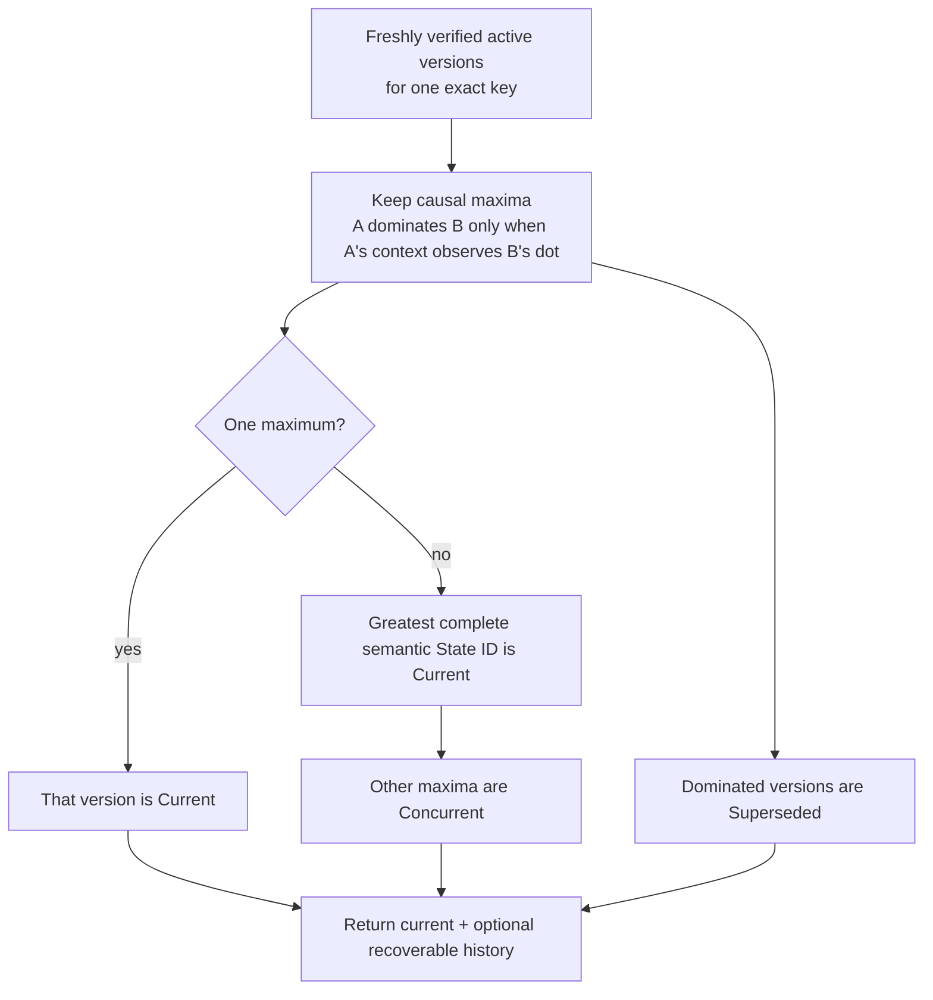

# Selected State API quickstart

This is the shortest path to Aster's **selected State projection**. A running
node exposes cloneable async publish, query, and durable delivery-subscription
handles, and the same composition retains an exclusive stopped facade for
maintenance or applications that do not need networking. Both return the
deterministic current value plus optional recoverable history without exposing
envelopes, cryptographic keys, sealed bytes, or reducer internals.

`RunningNode::selected_state()` returns `SelectedStateHandle`. Its clones send
commands through the actor's one bounded Event/State/Record lane; they do not
open another store or policy authority. `SelectedStateNode` remains the stopped
facade and owns the mission-bound writer exclusively. State reconciles over a
semantic-v4/v5 mission-authenticated, class- and direction-specific Negentropy
lane when the receiver configures an exact topic/scope interest.

Durable positive-current-version application delivery is available through the
selected Rust surface. It is not a synthetic-withdrawal or materialized-view
feed. Configured `NodeConfig` State interests remain the network receive policy;
subscriptions do not dynamically replace them. The selected store rejects
finite-TTL State because no forwarding-age path is implemented.

## Run the stopped example

Install the pinned toolchain, then create a disposable two-node fixture. The
demo provides a mission bundle and releases its stores before the State example
opens node 0 exclusively.

```sh
mise install
ASTER_STATE_ROOT="$(mktemp -d)"
cargo run --locked -p aster-node --bin aster -- \
  demo --nodes 2 --root "$ASTER_STATE_ROOT/mesh"

cargo run --locked -p aster-node --example state_application -- \
  "$ASTER_STATE_ROOT/mesh/node-0" \
  "$ASTER_STATE_ROOT/mesh/node-0/mission.unprotected-reference.bundle"
```

Expect one line shaped like:

```text
STATE current=<64 hex characters> value=moving counter=<n> ready_inserted=true moving_inserted=true recoverable=1
```

Run the State example again against the same directory. Both fixed operation
keys resolve their original durable publications, so `ready_inserted=false`
and `moving_inserted=false`; the current semantic identity and value remain
stable. The publisher counter need not start at one because selected Event and
State publications intentionally share one authenticated causal counter and
frontier.

The fixture persists explicitly unprotected reference mission material. It is
appropriate for this disposable demonstration, not operational provisioning.
Remove the temporary directory when you no longer need it.

## Use the live actor API

Start a `RunningNode` as shown in the
[selected Event guide](selected-event-api.md), then obtain and clone its State
handle. Publication and query are async because the running actor remains the
sole store authority:

```rust
let states = running.selected_state();
let retained = states.clone();

let request = StatePublishRequest {
    operation_key: b"my-app/state/asset-7/live".to_vec(),
    topic: topic.clone(),
    scope: scope.clone(),
    priority: Priority::Priority,
    logical_key: b"asset-7".to_vec(),
    payload: b"moving".to_vec(),
    tombstone: false,
};
let published = states.publish(request.clone()).await?;
assert!(published.inserted);
assert!(!states.publish(request).await?.inserted); // exact durable retry

let query = StateQuery {
    topic,
    scope,
    logical_key: b"asset-7".to_vec(),
    include_recoverable_versions: true,
};
let projection = states.query(query.clone()).await?;
assert_eq!(projection.current.expect("current State").id, published.id);

running.shutdown().await?;
let closed = retained.query(query).await.expect_err("actor is closed");
assert_eq!(closed.kind(), ApplicationErrorKind::StateUnavailable);
assert_eq!(closed.operation(), "state query");
```

Graceful shutdown closes application admission before releasing the writer.
The bounded same-UID Unix zeroization path does the same before erasing retained
secret artifacts. Retained handle clones therefore fail closed with sanitized
`StateUnavailable`; they never reopen the store or continue on a stale policy.
Event, State, and Record clones share one bounded command queue, and contacts
remain governed by the same actor-owned policy/store authority.

## Deliver positive current State versions durably

A State subscription selects every logical key under one exact topic/scope
filter. Polling returns at most one freshly authenticated positive `Current`
version per logical key when that version has unacknowledged work. Concurrent
losers, superseded ancestors, inactive versions, and acknowledged heads still
participate in the causal reduction. If a committed poll later classifies an
acknowledged version as noncurrent or inactive, its suppression tenure retires;
the same semantic version receives a new opaque token if a still-later poll
selects it as `Current` again. A current tombstone remains an explicit
empty-payload version rather than unauthenticated absence.

```rust
let subscription = states
    .subscribe(StateSubscriptionRequest {
        operation_key: b"my-app/state-subscription/assets".to_vec(),
        topic: topic.clone(),
        scope: scope.clone(),
        include_descendant_scopes: false,
    })
    .await?;

let page = states
    .poll(StatePollRequest {
        subscription: subscription.id,
        delivery_limit: MAX_SELECTED_STATE_DELIVERIES,
        scan_limit: MAX_SELECTED_STATE_SUBSCRIPTION_SCAN,
    })
    .await?;

for delivery in page.deliveries {
    assert_eq!(delivery.state.disposition, StateVersionDisposition::Current);
    process_current_version(&delivery.state, delivery.attempt)?;
    states
        .acknowledge(subscription.id, delivery.state.id, delivery.token)
        .await?;
}
```

The operation key identifies the selector across process restarts. An exact
retry returns the same subscription with `inserted=false`; changing its topic,
scope, or descendant flag fails as a conflict. Delivery attempts are incremented
in the same durable transaction that records the pending result. If the process
stops before acknowledgement and that version remains Current, reopening and
polling returns it with a larger attempt number. Acknowledgement and unsubscribe
are both idempotent. Each delivery carries the opaque token required for acknowledgement;
the token binds the subscription incarnation, exact State, current tenure, and
retry. Applications may persist or transport its canonical `as_bytes()` form
and restore it with `StateDeliveryToken::from_bytes`; after a crash they may
instead poll again and acknowledge the newly issued retry token. A token from
an older acknowledged tenure remains an idempotent replay
without consuming a later tenure, while an unacknowledged stale-tenure or
removed-and-recreated subscription token is rejected.

`scan_limit` bounds the complete matching candidate set that must be freshly
authenticated to compute the projection. If that complete matching set exceeds
that bound, polling fails without advancing attempts; it never computes a
current value from a partial snapshot. `has_more` instead means additional
verified, unacknowledged current heads remain beyond `delivery_limit`.

This is a positive-current-version queue, not a materialized projection or
transition feed. An empty page means only that no positive Current version is
currently deliverable; it does not mean the selected keys have no authorized
current value, and it does not invalidate a value previously processed by the
application. Revocation, rekey, or route-lineage replacement can make an exact
`StateQuery` return `current: None` without producing a synthetic withdrawal.
Applications that require the exact authorized projection at use time must
query the known logical key. The queue does not report transitions that occur
and reverse entirely between committed polls.

The subscription is application-delivery intent, not network or cryptographic
authority. Configure the corresponding State receive interest on networked
receivers, and keep authorization in the mission bundle. Every poll still
rechecks current control policy, source authenticity, content authority, route
lineage, and the complete causal projection before returning plaintext.

Focused current-code automation covers peerless durability, exact retry,
restart, shutdown admission, and protected same-epoch rekey recovery:

```sh
cargo test --locked -p aster-node \
  runtime::tests::live_selected_state_and_record_are_durable_idempotent_and_close_admission \
  -- --exact
cargo test --locked -p aster-node \
  runtime::tests::protected_live_mutable_handles_cache_exact_retry_across_same_epoch_rekey \
  -- --exact
```

## Reconcile live State over a contact

Use `SelectedStateHandle` while the network actor runs. If an application chose
the stopped `SelectedStateNode` facade instead, close it before starting the
actor because both deliberately require the same mission-bound writer. On every
receiving node, add one repeatable exact interest for each desired topic and
scope:

```sh
aster node ... --state-interest sensors@mission/alpha
```

An empty State interest set means receive-none, never wildcard. Topic/scope
interest is only desired receipt: current mission membership, route authority,
content authority, source authentication, revocation, and scope epoch still
have to pass. Remote finite-TTL State is rejected. Semantic versions 1 through
3 run their Event compatibility lanes but contain no State interest, inventory,
fetch, offer, result, or finish frames.

On semantic v4 or v5, Normal and every `AtLeast` Event threshold still run the
State lane; the threshold does not filter State. `ReceiveOnly` initiates and
discloses no State lane. An object is limited to 1 MiB, and selected State
storage is capped at 4,096 rows and 16 MiB of encoded source bytes. Capacity
saturation is an authenticated deferred outcome, not a duplicate or integrity
success. Fetch result and acknowledgement must match exactly, as must both
finish remainders. A durable cursor rotates the authenticated
peer/class/local-mode starting point so bounded contacts do not permanently
prefer the same ID.

The focused real-carrier automation publishes different State versions through
live handles on two peerless nodes, later makes direct mission-authenticated Iroh
contacts under exact interests, and verifies both live projections converge on
the same current and concurrent versions:

```sh
cargo test --locked -p aster-node \
  runtime::tests::live_mutable_handles_converge_disconnected_state_and_record_then_resolve \
  -- --exact
```

Old same-epoch lineage is withheld from ordinary current projection/query and
network inventory/transfer; only an exact idempotent publish retry may recover
its committed result through strict cached, projection, and historical
verification.

## Use the stopped API

The complete runnable source is
[`crates/aster-node/examples/state_application.rs`](../../crates/aster-node/examples/state_application.rs).
Its central shape is:

```rust
let mut states = SelectedStateNode::open_unprotected_reference(
    state_directory,
    mission_bundle,
)?;

states.publish(StatePublishRequest {
    operation_key: b"my-app/state/asset-7/ready".to_vec(),
    topic: topic.clone(),
    scope: scope.clone(),
    priority: Priority::Priority,
    logical_key: b"asset-7".to_vec(),
    payload: b"ready".to_vec(),
    tombstone: false,
})?;

states.publish(StatePublishRequest {
    operation_key: b"my-app/state/asset-7/moving".to_vec(),
    topic: topic.clone(),
    scope: scope.clone(),
    priority: Priority::Priority,
    logical_key: b"asset-7".to_vec(),
    payload: b"moving".to_vec(),
    tombstone: false,
})?;

let projection = states.query(StateQuery {
    topic: topic.clone(),
    scope: scope.clone(),
    logical_key: b"asset-7".to_vec(),
    include_recoverable_versions: true,
})?;
let current = projection.current.expect("published State has a current value");
assert_eq!(current.payload, b"moving");
assert_eq!(current.disposition, StateVersionDisposition::Current);
```

Choose an operation key for the application effect, not for an individual
attempt. Reusing it with the same request and payload returns the original
commit; changing the request or payload fails closed. Topic, scope, publisher,
key epoch, logical key, priority, content length, tombstone flag, causal stamp,
and payload digest are authenticated. The selected store additionally bounds
operation keys to 1–256 bytes, logical keys to 1–4,096 bytes, retained versions
to 1,024 per exact key, and the dedicated durable State operation ledger to
4,096 rows and 512 KiB. That ledger also participates in aggregate store quotas.

`StateQuery` always identifies one exact topic, scope, and logical key. Setting
`include_recoverable_versions` returns active retained versions other than the
current one, annotated as `Concurrent` or `Superseded`. It does not weaken the
deterministic current projection.

## Understand causal latest value

State never uses wall-clock timestamps to choose a winner:



The tie-break compares the complete source-authenticated semantic State ID. It
does not imply last-writer-wins, delete-wins, or clock authority. Sequential
publication by one selected node normally makes the later version observe the
earlier dot, so the example's `ready` version is `Superseded`. Concurrent
maxima are preserved and surfaced rather than silently discarded.

## Treat tombstones as authenticated State

A tombstone is another source-authenticated State version and must carry an
empty payload:

```rust
states.publish(StatePublishRequest {
    operation_key: b"my-app/state/asset-7/deleted".to_vec(),
    topic: topic.clone(),
    scope: scope.clone(),
    priority: Priority::Priority,
    logical_key: b"asset-7".to_vec(),
    payload: Vec::new(),
    tombstone: true,
})?;
```

If that version is current, `projection.current` remains `Some(StateItem)` with
`tombstone == true`. The facade never turns authenticated deletion into an
indistinguishable absence. Concurrent edits and tombstones follow the same
semantic-ID tie-break; this slice has no special delete-wins rule. Retention is
not duration-bounded by this slice: storage capacity is bounded by row, byte,
per-key version, and operation-ledger quotas, while tombstone retention
duration, expiry, compaction, and garbage collection remain open.

## Verification and ownership boundary

Publish, exact retry, and query always pass current policy, revocation, source,
content, and projection checks. Store rows and projection plans are structural
inputs, not authorization capabilities.

The live actor and stopped facade cannot own the same store concurrently. Stop
the actor before opening `SelectedStateNode`, and close that facade before
starting the actor. See the [selected architecture](../architecture.md) for the
complete trust path, the [selected Event API](selected-event-api.md) for the
live runtime, and [requirements status](../validation/requirements-status.md)
for validation coverage.
