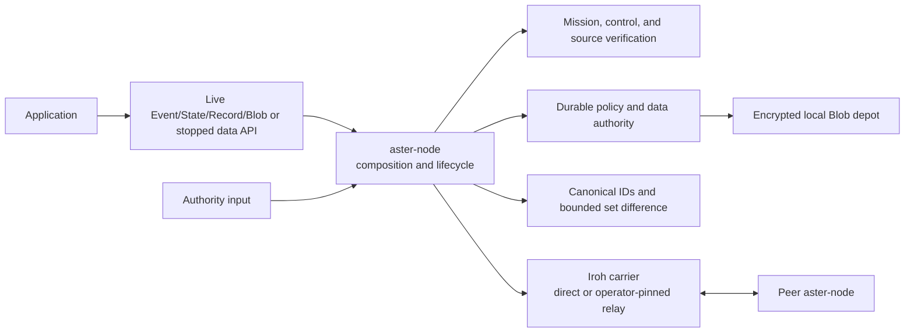
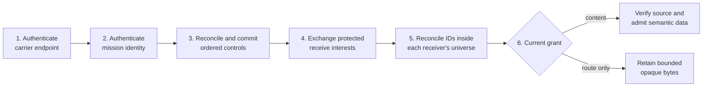

# Carriers and contacts

This guide distinguishes the selected Iroh carrier/storage composition
from the proven semantic implementation whose protocol and carrier behavior is
being migrated onto it. Read [Core concepts](concepts.md) first if terms such as
node, topic, or scope are new.

## Choose your path

| Goal | Start at |
|---|---|
| Run the selected networked implementation | [Selected direct-Iroh contact](#selected-direct-iroh-contact) |
| Embed the broader semantic host | [Current semantic host lifecycle](#current-semantic-host-lifecycle) |
| Configure UDP/IP | [Current semantic IP example](#current-semantic-ip-example) |
| Implement a platform BTLE adapter | [Current semantic BTLE integration seam](#current-semantic-btle-integration-seam) |
| Add another carrier | [Carrier migration and extension](#carrier-migration-and-extension) |
| Plan an operational deployment | [Before a real deployment](#before-a-real-deployment) |

## The important separation

Application semantics, mission authentication, control/source authorization,
durable state, reconciliation, and carrier mechanics have separate owners.



`aster-iroh` owns endpoint lifecycle and bounded exchange; its endpoint
identity is not mission membership or data authorization. `aster-core` owns
the hybrid mission session and protected control/source objects.
`aster-profile` and `aster-negentropy` own canonical transfer ordering and
set difference, not policy or causality.

`aster-redb-store` is the mission-bound transaction authority for ordered
control effects, active policy and selector snapshots, accepted objects,
at-least-once Event delivery, durable positive-current-version State delivery,
durable whole-key active-head Record delivery, route-only Event
representations, and local State, Record, and Blob state. The
sibling depot stores bounded Blob ciphertext; redb owns its committed-file
markers and publication authority.
`aster-node` is the only selected composition root.

The selected runtime networks Event, State, and Record and exposes cloneable
live Rust handles for all three through one bounded actor command lane. It also
gives State a durable application subscription/poll/acknowledgement queue for
freshly verified positive current versions and gives Record a separate durable
whole-key active-head queue. Neither application selector mutates its separately
configured network receive interest. The runtime also
exposes a cloneable live Blob handle: publish accepts an already-open regular
file at cursor zero, bounded to 64 MiB and 1,024 canonical 64-KiB chunks, and a
live read returns at most 64 KiB of plaintext per zeroize-on-drop page. Under
semantic v5, the same selected runtime automatically reconciles
already-durable Blob sources and transfers peer-neutral contiguous carrier
ranges of at most 16 KiB directly between content-capable peers. The broader
semantic implementation remains the migration source for behavior that has not
yet moved into this composition.

## Capability boundary

| Path | Implemented | Boundary |
|---|---|---|
| Selected direct Iroh | Manually admitted exact endpoint ID and socket, authenticated direct UDP/QUIC, and bounded exchange | Carrier identity is separate from mission and data authorization; no address discovery, port mapping, dynamic-NAT policy, or multi-carrier failover |
| Selected nearby Iroh discovery | Feature-gated Iroh mDNS lookup using an exact roster or mission-authenticated `--discover-lan`; each window is at most 30 seconds | Default off; upstream observations are not globally capped, so this is not a hostile-LAN or production discovery service |
| Selected controlled Iroh relay | One operator-pinned HTTPS relay with explicit trust, alongside an initial direct locator or with IP disabled | No public/default relay selection; the relay is transport infrastructure rather than an Aster mission or payload-blind application relay |
| Selected node and CLI | Networked Event, State, and Record reconciliation; semantic-v5 direct Blob transfer; live and stopped Rust APIs; bounded application delivery; payload-blind Event relay; restart/idempotency; Unix zeroization | Reference provisioning; no dynamic application-driven network interests, automatic Record merge, route-only Blob custody, finite State/Record/Blob TTL, generalized control administration, or production authorization |
| Current semantic in-memory link | High-level host contact, authentication, reconciliation, resume, and failure behavior | Reference carrier; not wired to the selected composition |
| Current semantic UDP/IP | Nonblocking link, manual endpoint mapping, protected local discovery, rendezvous helpers, opaque relay components | Migration onto the selected node; full host acceptance on physical or operational networks |
| Current semantic NAT/rendezvous and relay | Bounded rendezvous, endpoint-punching, and opaque-relay helpers | Not integrated into the selected node |
| Current semantic BTLE | MTU-aware link, unicast plus an advertisement primitive, disconnect handling, platform `BleRadio` seam | Selected-node integration; a shipped Android, iOS, Linux, or controller-specific radio driver; complete one-to-many profile |
| LoRa, serial, file | The requirements and semantic design do not preclude them | No selected adapters ship |

Deployment evidence and open gates are tracked in
[requirements status](validation/requirements-status.md) and
[conformance](validation/conformance.md); code presence alone is not deployment
credit.

## Selected direct-Iroh contact

Use the [capability tour](quickstart/capability-tour.md) for the fastest two-node
path. The [live mesh CLI quickstart](quickstart/mesh-cli.md) owns the runnable
three-node relay example and the
[four-role control scenario](quickstart/mesh-cli.md#run-the-four-role-control-scenario).

For separately managed processes, initialize a unique persistent state root on
each system, exchange the endpoint IDs printed by `aster init`, and separately
provision a reference mission bundle and mission `NodeId` for each node.
Configure both sides with exact
`CARRIER_ID@IP:PORT=MISSION_NODE_ID_HEX64` bindings and pass each local bundle
through `--mission-bundle-unprotected-reference`. The carrier fails closed when
its handshake identity is not in the configured allowlist; the node then fails
closed unless the mission identity also matches. With no controlled relay or
explicitly feature-gated nearby flags, the direct path performs no address
lookup, relay discovery, or port mapping.

Iroh carrier authentication is not Aster mission authentication and does not
satisfy zero trust by itself. `aster-node` carries the existing `aster-core`
four-flight hybrid session over that carrier, binds mission `NodeId`
independently from Iroh `EndpointId`, and gates inventory on success. Event then
uses the existing source-protected envelope after the existing ordered control
provider has reconciled and activated a gap-free prefix: current peer scope/epoch
route grants remain an upper bound on inventory and Offer; the receiver's
mission-protected canonical Consume/Carry interest narrows each direction
further, and empty interest means receive-none. Content grants gate semantic
acceptance and reaction; revoked mission principals fail closed.

### Short-lived nearby discovery

An explicitly discovery-enabled build also accepts
nearby-peer bindings in the form CARRIER_ID=MISSION_NODE_ID_HEX64 plus a
whole-second nearby window from 1 through 30 seconds. This replaces the manually entered
socket locator; it does not replace either identity. Direct peer routes and a
controlled relay are rejected in the same configuration.

The runtime installs the official Iroh mDNS lookup only for that window and
only under normal emission policy. It publishes direct Iroh carrier addresses
and carrier identity, with no lookup user data. Mission identity, authority,
topic, scope, priority, membership, inventory, and application payload stay out
of DNS-SD records. On-link presence, carrier identity, address, timing, and
packet size remain observable.

That rostered mode remains available. A separate `--discover-lan` mode takes no
`--peer` or `--nearby-peer` value and rejects either combination. Each
whole-second window is 1 through 30 seconds (10 by default); the runtime repeats
windows while it is running and its emission policy remains Normal. An mDNS
result is only an untrusted carrier locator. The runtime completes carrier
authentication, the existing hybrid-PQ mission handshake, and current mission
authorization before inventory. A carrier candidate from a different mission
authority is rejected before application exchange.

Automatic mode retains at most 32 outbound locator candidates and at most 32
distinct mission-authenticated identities for automatic admission before
inventory. At most 16 inbound contact workers and 16 outbound contact workers
run concurrently. These are separate bounds, not a global inbound-carrier cap:
the upstream mDNS provider can observe and retain more peers before Aster's
candidate, admission, and concurrent-worker boundaries apply.

Both modes are default-off and are not hostile-LAN or production discovery
services. Mission proof is scoped to the same contact; this implementation does
not bind it to a TLS exporter or prove common ownership of the carrier and
mission keys. [ADR 0036](decisions/0036-mission-authenticated-lan-discovery-mvp.md)
defines the selected boundary, and the
[three-host LAN Event quickstart](quickstart/lan-mvp.md) gives the operator
procedure.

The live selected Event, State, Record, and Blob handles compose high-level
operations with this path through the running actor's shared bounded command
lane. Blob file work is delegated to a joined worker with capacity one; the
shared application lane has capacity 32. Blob publication and reads require a
fresh selected source, current policy/lineage, and the exact authenticated
`BlobDepotCompletion` capability. A contradiction among durable rows,
authenticated cache state, depot capability, or post-commit verification is a
`FatalBlobCoherence` failure that closes application admission and terminates
the actor rather than becoming an ordinary request error. Event's
`LastContactComplete` reports only the most recent bounded negotiation with each
active configured peer; it does not assert State/Record or global convergence.
The mission bundle is owner-only on Unix but explicitly unprotected-reference
at rest; other platforms fail closed because that owner-only contract cannot be
verified.



The phases above describe the Event lane of the manual direct-Iroh selected slice
with unprotected-reference provisioning. The same mission contact also runs
class-specific State and Record difference/fetch lanes under explicit receiver
topic/scope interests in semantic v4/v5. Under v5, content-capable peers
additionally reconcile exact Blob sources before transferring bounded missing
carrier prefixes; v1-v4 emit zero Blob frames. Carrier authentication does not
grant mission membership, route authority does not grant content access, and a
subscription cannot expand either authority. Consume selectors also drive local
poll delivery; Carry selectors drive receipt/forwarding without local poll
delivery. Both modes project to the same protected wire interest.

On Unix, a same-UID operator can invoke `aster zeroize` against the exact state
and mission-bundle paths. A live node accepts the request only through an
owner-only local socket bound to the state/store inode identities, stops new
work, drains its owned contact tasks, closes its endpoint, and drops derived
secret holders. A stopped node instead obtains the exclusive store writer. Both
paths durably record exact non-secret artifact descriptors before overwriting,
synchronizing, and truncating the retained mission-bundle and carrier-identity
inodes. The pathnames remain owner-only zero-length tombstones, and normal store
open remains terminally denied. Read-only audit inspection and preserved data
rows remain available, as does the encrypted Blob depot. This is cryptographic
shredding of the mission/content and carrier-identity secrets, not deletion or
physical sanitization of depot ciphertext.

This hook is local, not a control message or remote carrier action. It neither
deletes the inode nor guarantees when an arbitrary mid-flight stream disappears
from a remote peer. It makes no claim about physical flash, copy-on-write
history, snapshots, swap, backups, replacement of the retained redb database,
or non-Unix platforms. Exact usage and the crash-resumption boundary are in the
[CLI quickstart](quickstart/mesh-cli.md#trigger-bounded-local-software-zeroization).

## Current semantic/reference carrier composition

The repository also retains the current semantic application and host surfaces:

- `ApplicationNode` is the offline application surface.
- `MeshService` composes that application surface with authenticated sync, Blob
  transfer state, and configured `Link` implementations.
- `IpLink` and `BleLink` implement the same opaque-fragment contract.
- The maintained [implementation-boundary table](../README.md#current-implementation-boundary)
  records which operations each Rust and language-binding surface exposes.

## Current semantic host lifecycle

The high-level host has a small, nonblocking lifecycle:

1. Open `MeshService`. It is immediately available for offline application
   operations.
2. Configure one or more carriers for known peer identities while no contact is
   active.
3. Call `begin_sync(peer)` when a contact opportunity exists.
4. Call `pump()` from the host event loop after carrier readiness, an application
   command, or the next scheduled wakeup.
5. Inspect application subscriptions or peer status for useful progress.
6. Call `pause_sync()` when the contact ends or another peer should be serviced.

The current bounded profile services one authenticated contact at a time. The
caller chooses the peer for that contact with `begin_sync(peer)`. If several
carriers are configured for that peer, `MeshService` chooses among them in
per-peer round-robin order; it does not score reachability,
bandwidth, cost, or emission characteristics, and a failed contact does not
automatically fail over to the next carrier. Pausing destroys session keys but
retains verified objects and partial Blob ranges. A later `begin_sync(peer)`
selects the next configured carrier for that peer.

`pump()` is nonblocking. Do not drive it in a busy loop. Integrate it with the
platform's I/O readiness and timer mechanism.

## Current semantic Rust host setup

The transport quickstarts assume two **different** authority-issued node bundles
with compatible mission, scope, topic, and epoch access. Do not copy one bundle
to two nodes: that clones the identity and durable publisher counter owner.

Create the service policy once per node:

```rust
use aster_host::{ServiceOptions, SyncProfile};
use aster_mesh::{ApplicationNodeOptions, BlobStoreConfig, Priority, Scope, Topic};

let sync = SyncProfile::new(
    vec![Topic::new("position.current")?],
    vec![Scope::new("mission/team/alpha")?],
    Priority::Routine,
)?;

let options = ServiceOptions {
    node: ApplicationNodeOptions::default(),
    blobs: BlobStoreConfig::default(),
    sync,
};
```

`SyncProfile` is the interest used for authenticated contacts. It bounds the
topics, scopes, and minimum received priority; it is not an application
subscription and does not grant access beyond provisioning.

Open each node with separate durable database and Blob directories:

```rust
use aster_host::MeshService;

let mut alice = MeshService::open(
    "alice.db",
    "alice-blobs",
    &alice_provisioning_bundle,
    alice_options,
)?;

let mut bob = MeshService::open(
    "bob.db",
    "bob-blobs",
    &bob_provisioning_bundle,
    bob_options,
)?;
```

At this point both nodes can publish, query, and subscribe while offline.

## Current semantic IP example

`IpLink` uses nonblocking UDP. The simplest integration uses known peer socket
addresses:

```rust
use aster_ip::IpLink;
use std::net::{IpAddr, Ipv4Addr, SocketAddr};

let loopback_port = || SocketAddr::new(IpAddr::V4(Ipv4Addr::LOCALHOST), 0);

// This token groups protected discovery traffic. It is never transmitted, and
// IpLink rejects an all-zero value.
let discovery_token = [0x42; 16];
let discovery_target = None; // Use Some(multicast_addr) for broadcast discovery.

let alice_link = IpLink::bind(
    "alice-to-bob", loopback_port(), discovery_token, discovery_target,
)?;
let bob_link = IpLink::bind(
    "bob-to-alice", loopback_port(), discovery_token, discovery_target,
)?;

// Manual peering binds the expected authenticated NodeID to a UDP endpoint.
// Authentication still happens in Aster; this map does not replace it.
alice_link.register_peer(bob.identity(), bob_link.local_addr()?)?;
bob_link.register_peer(alice.identity(), alice_link.local_addr()?)?;

alice.configure_peer_carrier(bob.identity(), alice_link)?;
bob.configure_peer_carrier(alice.identity(), bob_link)?;

alice.begin_sync(bob.identity())?;
bob.begin_sync(alice.identity())?;
```

`IpLink::bind`'s fourth argument is `discovery_target`. `None` disables the
announcement/broadcast destination, as in the manual-peering example. `Some`
provides the address used by `announce()` and peerless link sends. When that
address is an IPv4 multicast address, `bind` also joins that group on the
unspecified interface and enables multicast loopback. Other `Some` addresses
are send targets only; the deployment remains responsible for any corresponding
receive-side network setup.

The 16-byte discovery token is provisioned group material, not a NodeID or a
bearer value. It is never transmitted: discovery packets carry fresh nonces and
derived proofs. `IpLink::bind` rejects the all-zero token, including when manual
peering uses `discovery_target = None`.

Drive both services from their host loops until the desired item appears in a
subscription or bounded query, then pause the contact. Aster does not make a
remote-delivery promise from the local publish result.

### Current semantic discovery, rendezvous, and relay

The IP crate provides separate tools for three deployment situations:

- **Known address:** register a provisioned peer NodeID and socket address
  directly. This is the smallest path and the best place to begin.
- **Local discovery:** announcements use a provisioned opaque discovery token,
  fresh nonces, and a challenge/response before an endpoint becomes a candidate.
  Discovery does not replace authenticated session identity.
- **NAT/rendezvous:** rendezvous helpers can coordinate endpoint punching where
  the network permits it. NAT behavior is environmental; success is never
  universal.
- **Opaque relay:** the relay path can forward protected Aster traffic when
  direct reachability fails. A relay is useful infrastructure, not part of data
  correctness and not automatically a content reader.

These semantic/reference helpers are migration sources, not the selected
controlled-Iroh relay path above.

Start with manually known addresses. Add discovery or rendezvous only after the
authenticated two-node path is understood and measured in the target network.

## Current semantic BTLE integration seam

The BTLE crate deliberately does not choose an operating-system Bluetooth API.
Your platform integration implements the narrow `BleRadio` trait:

```rust
use aster_ble::{BlePacket, BleRadio};
use aster_mesh::NodeId;
use std::io;

struct PlatformRadio {
    // Android, iOS, BlueZ, controller, or device-specific handles live here.
}

impl BleRadio for PlatformRadio {
    fn name(&self) -> &str { "platform-btle" }
    fn unicast_mtu(&self) -> usize { 185 }
    fn broadcast_mtu(&self) -> Option<usize> { None }

    fn send(&self, peer: NodeId, bytes: &[u8]) -> io::Result<()> {
        // Send one already-fragmented opaque packet over L2CAP or GATT.
        todo!()
    }

    fn broadcast(&self, _bytes: &[u8]) -> io::Result<()> {
        Err(io::Error::new(io::ErrorKind::Unsupported, "no advertisements"))
    }

    fn try_receive(&self) -> io::Result<Option<BlePacket>> {
        // Return immediately; Ok(None) means no packet is ready.
        todo!()
    }

    fn set_discovery(&self, enabled: bool) -> io::Result<()> {
        // Map Aster's emission policy to scanning/advertising state.
        todo!()
    }

    fn bits_per_second(&self) -> Option<u64> {
        // Optional current estimate reported through LinkCharacteristics.
        Some(125_000)
    }
}
```

Wrap it and register it exactly like any other carrier:

```rust
use aster_ble::BleLink;

let link = BleLink::new(PlatformRadio { /* platform handles */ }, alice.identity());
link.set_peer_mtu(bob.identity(), negotiated_application_mtu)?;
alice.configure_peer_carrier(bob.identity(), link)?;
```

The radio must be nonblocking and must reject outbound packets above its current
useful MTU. `BleLink` silently drops an oversized inbound packet and continues
draining the radio. Override `BleRadio::bits_per_second` when the platform has a
useful current estimate; the default is unknown.

On disconnect, the platform integration must call
`BleLink::disconnected(&peer)` so the peer's link-local negotiated MTU is
removed; verified object progress remains in the core store. The current
`BleLink::new(radio, local_node)` API accepts `local_node` for its composition
shape but does not use it internally, so callers must not rely on the adapter to
check or bind the local identity.

BTLE advertisement support is a carrier primitive. It is not a claim
that the complete authenticated replication exchange has a one-to-many broadcast
profile.

## Carrier migration and extension

The current semantic carrier pattern implements the `Link` contract exposed by
`aster-core`'s `adapter-sdk` feature. It supplies:

- a stable diagnostic name;
- characteristics such as MTU, estimated bit rate, cost, emission footprint, and
  broadcast capability;
- nonblocking send and receive of opaque fragments; and
- discovery enable/disable behavior.

The carrier must not parse application items, invent routing semantics, perform
conflict resolution, or treat transport security as Aster authentication. The
core owns fragmentation, handshake, replay defense, exact reconciliation,
source verification, and reducers.

Use the `Link` trait and existing IP/BTLE adapters as semantic and test migration
sources. The selected node does not yet expose the final multi-carrier adapter
contract, so a new production adapter must not create a second persistence,
reconciliation, authentication, or scheduling authority. Use the
[binding pattern](bindings/pattern.md) for a language API.

## Semantic protocol versions you may see

Aster separates stable bytes from negotiated behavior. The current selected
implementation offers semantic versions `[6, 5, 4, 3, 2, 1]` in that descending
order:

- **Replication wire/profile version 1** identifies the current encoding and
  fixed security-object family.
- **Semantic version 6** is offered first. It inherits ordinary Event,
  compact-batch, custody, State/Record, and Blob behavior from version 5 and
  adds only the opt-in selected Event-bridge mechanics lane. Semantic versions
  1 through 5 emit zero Event-bridge frames.
- **Semantic version 5** remains a compatibility option. It inherits Event,
  compact-batch, authorized cross-scope route, custody, and semantic-v4
  State/Record behavior and adds selected
  direct content-capable Blob source-before-carrier transfer with
  completion-gated visibility. Semantic versions 1 through 4 emit zero Blob
  frames.
- **Semantic version 4** remains a compatibility option with Event behavior and
  protected, class- and direction-specific State/Record reconciliation.
- **Semantic version 3** remains an Event-compatible option with bounded
  session-authenticated Event/RouteEvent custody and no State/Record frames.
- **Semantic version 2** remains a compatibility option for compact batches and
  authorized cross-scope routes without semantic-v3 custody.
- **Semantic version 1** remains a compatibility option for singleton Event
  transfer and has no State/Record or Blob frames.

The process-wide version constants report implementation support, not what a
particular session negotiated. Application code normally does not branch on
these values. See the [compatibility and deprecation
policy](deprecation-policy.md) for support windows, stored-data obligations,
and the required procedure for retiring protocol, suite, ABI, binding, or
registry values.

Transcript binding rejects an unauthenticated on-path rewrite of the offer or
selection, but negotiation does not authenticate a responder's complete
capability set. An older, rolled-back, or modified peer can honestly complete
semantic version 1. A deployment that depends on downgrade resistance must
therefore fail closed at release authorization until it has the authority-signed
minimum, durable per-identity capability high-water, signed rollback
authorization, mixed-version evidence, and independent interoperability
evidence defined by the [deprecation policy](deprecation-policy.md). Version 1
compatibility is not downgrade-resistance evidence.

## Before a real deployment

- Complete the migration ledger in
  [production requirements status](validation/requirements-status.md), and
  do not interpret the direct-Iroh carrier handshake as mission authentication
  or the reference mission session as source-item authorization.
- Issue distinct operational bundles through an approved provisioning process,
  wrap them with an admitted protected-artifact provider, and do not fall back
  to the raw fixture/compatibility path.
- Define persistent secret custody, unattended startup, backup/recovery, and
  destroy behavior separately from artifact encryption.
- Set quotas, retention, priority caps, and sync interests for the device tier.
- Decide how the host obtains peer identities and endpoints.
- Integrate nonblocking carrier readiness and wakeups without polling.
- Capture every enabled physical carrier and compare it with the privacy
  canaries in [Security](security.md).
- Run the relevant loss, bandwidth, restart, alternate-peer, and large-Blob
  scenarios in [Conformance](validation/conformance.md).
- Treat every open item in [Conformance](validation/conformance.md) as an explicit
  acceptance decision, not an implied guarantee.
